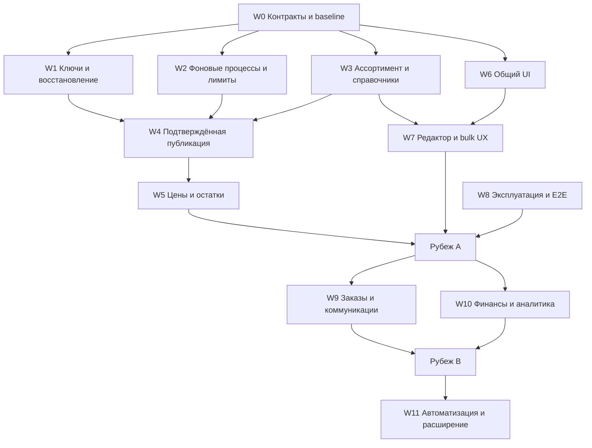

# Ozon: аудит реализации и план полноценного запуска

**Текущая волна принята 26.09, 20:52 UTC:** runtime `d7d3f54d…` добавил durable продолжение каталога, чтение складов/exact FBS, Vue review ручной связи и категории, точный поиск ID и ожидание локального фото. На exact image прошли 72 browser checks / 344 layouts; production подтвердил исходное фото ID 57 после локального 202→200 без перезагрузки, общий и bulk UI, а также сохранность прежних completed read jobs и восьми protected групп. Это приёмка read/UI волны, не полный запуск Ozon и не provider-write пилот. После сообщения владельца о полном доступе точечный `/v1/roles` в 20:57:31 UTC подтвердил 11 exact grants загрузки карточек; реальные create/update, buyer price и inbox не проверены этим ответом, прежние 403 остаются историческими наблюдениями. [Текущий отчёт и границы](operations/2026-09-26-ozon-resumable-reads-and-vue-review.md). [Короткая доска оставшихся работ](OZON_REMAINING_WORK_2026-09-26.md) отделяет доказанные чтения от открытых live-гейтов.

**Предыдущий принятый production выпуск 26.09, 20:14 МСК:** image `595fa6cb7ea7…` принят: healthy/0 restarts. W1/W4: отдельный Vue-разбор неизвестного исхода, явная остановка новых записей по immutable товару или просмотренному кабинету, append-only журнал и снятие только после доказанного результата исходной операции. Общий guard защищает карточки, цены, остатки, queue/batch/rollback. Full CI: 1634 tests +452 subtests; exact-image 52 сценария/272 layouts. Production: 25 основных страниц +3 новых страницы разбора, 240 layouts суммарно, 6 категорий, 73/73 фото. Local backup реально восстановлен, миграция проверена; четыре protected набора данных неизменны, реальных решений ради smoke не создавали. Статус доставлен 2/2 Telegram-подписчикам. [Отчёт](operations/2026-09-26-ozon-operation-quarantine.md). Внешние backups отложены; buyer price/inbox, факты для публикации, live stock/shipping и пилот остаются открыты.

**Предыдущий выпуск 26.09, 18:38 МСК:** image `29a5f754e159…` принят: healthy/0 restarts. W1: отдельные безопасные настройки label/default VAT и append-only история действий, actor/version/group locks, Vue conflict/lost-response review. 1464 tests +385 subtests, exact-image 38 сценариев/200 layouts; production 25 страниц/216 layouts, 6 категорий, 73/73 фото. Проверенный local backup реально восстановлен; ключи/операции/черновики/заявки сохранены. Общий статус доставлен 2/2 Telegram-подписчикам. [Отчёт](operations/2026-09-26-ozon-account-settings-history.md). Внешние backups отложены; последующий пакет разбора неизвестного исхода принят 26.09, 20:14 МСК.

**Предыдущий выпуск 26.09, 17:33 МСК:** image `e81fd556ead03…` развёрнут и принят: healthy, 0 restarts. W1: in-app expiry notices 14/7/1 день/expired, дедуп, Vue recovery, обязательная viewed version при ротации и явное перечитывание после конфликта двух вкладок. **1435 tests +373 subtests**, 30 browser scenarios/175 layouts; production 25 страниц/150 layouts + recovery 3/12 + партии 6/48, 6 категорий, 73/73 фото. Локальный snapshot реально восстановлен; additive migration/repeat/FK/protected rows проверены. Реальный ключ/история неизменны, live expiry warning пока не нужен. [Выпуск](operations/2026-09-26-ozon-credential-expiry.md). Внешнее хранилище backup по-прежнему отложено.

**Предыдущий выпуск 26.09, 15:43 МСК:** image `f7a81b581899…` развёрнут в 15:34 МСК, принят в **15:43 МСК**: healthy, 0 restarts. **1375 tests + 373 subtests**, единая команда exit 0 за 555,61 s; **23 browser scenarios / 150 layouts** на точном кандидате. Production: общий проход **25 страниц / 150 layouts**, 6 категорий, 60/60 фото и 6 ценовых представлений; repair — **6 сценариев / 48 layouts**, 3 реальные партии, 13 строк и 13 фото. W7: массовый Vue-редактор с фото, preview/исключениями, exact selection, partial receipt, сохранением ошибочного ввода, конфликтами и readback неизвестного POST. Повторный вход обновляет CSRF без сброса формы. История price/stock сохранена; heartbeat +120.1 s. [Отчёт](operations/2026-09-26-ozon-bulk-repair-vue.md). Общий статус доставлен всем активным Telegram-подписчикам (2/2). Штатный каталог завершён после restart: 8719 карточек, 10 страниц, 0 warnings. Buyer price/inbox/реальные данные для публикации и остальные A+B gates открыты.

**Эксплуатационный пакет 26.09, 16:23 МСК:** ежедневные локальные verified copies и независимый от приложения host observer приняты без app restart; свежая копия 13,66 GB → 1,79 GB, round-trip SHA/quick_check, free после 20,57 GB. 101 focused tests, 25 страниц +3 repair-партии/198 layouts/73 фото. Внешнее хранилище отложено владельцем. [Отчёт](operations/2026-09-26-local-backups-and-observer.md).

**Предыдущий выпуск 26.09, 14:26 МСК:** image `9d0bf9fd8fe54…` развёрнут, healthy, 0 restarts. W8: повторяемая регрессия одной командой — 1357 tests + 373 subtests, browser 14 сценариев/86 layouts, negative drill и экспорт evidence, без production credentials/network. Исправлен возврат после входа с сохранением account/фильтров и защитой от внешнего redirect. Production: 25 страниц/150 layouts, 6 категорий, 60/60 фото, 6 ценовых представлений; quality дополнительно 4/16/25 фото. История price/stock сохранена, heartbeat продвинулся на 120.53s. [Отчёт](operations/2026-09-26-ozon-release-regression.md). Workflow GitHub подготовлен; hosted CI/branch gate ещё не подтверждён. Рассылка статусов всем активным `/start` подписчикам работает. Остальные A+B gates открыты.

**Предыдущий выпуск 26.09, 13:22 МСК:** image `b2fda91b09480…` развёрнут, healthy, 0 restarts. W6/W7/W8: Vue-список качества с фото, объяснимыми причинами, сохранением поиска/выбора/URL и фоновым пересчётом всего каталога. 130 regression tests + 1 отдельный CSRF test; стенд 12 сценариев/72 layouts. Production: quality 4/16 и 25/25 фото; общий проход 25 страниц/150 layouts, 6 категорий, 60/60 фото, 6 ценовых представлений, без ошибок. Один явный local POST завершил пересчёт всех 8111 карточек после закрытия браузера за 406.5 с; повторное открытие показало completed. Новых Ozon writes/probes нет. [Отчёт](operations/2026-09-26-ozon-quality-workspace.md). Финансовая API-проверка предыдущего выпуска сохранена; внешний отчёт владелец предоставит позже. Остальные A+B gates открыты.

**Предыдущий выпуск 26.09, 12:29 МСК:** image `97cfb9c9f4e9…` развёрнут, healthy, 0 restarts. W10: Vue-история сравнивает две финансовые загрузки по общим дням, показывает изменившиеся факты и точные версии. 69 tests; стенд 12 сценариев/56 layouts. Production: новая страница 3/16, общий проход 25 страниц/150 layouts, 6 категорий, 60/60 фото, 6 ценовых представлений, без ошибок. Реальный API: 29 закрытых дней, 70 начислений, 41 SKU-строка и 90 компонентов полностью совпали; отдельный `accrual/postings` дважды вернул 429, включая попытку после cooldown, поэтому этот контракт не подтверждён. Свежий DB backup реально восстановлен и проверен до deploy. [Отчёт](operations/2026-09-26-ozon-finance-comparison.md). Независимый отчёт владелец предоставит позже; бухгалтерская сверка и остальные A+B gates остаются открыты.

**Предыдущий выпуск 26.09, 01:28 МСК:** image `72cdc6236fa18…` развёрнут, healthy, 0 restarts. W8: Vue «Состояние магазина» показывает подключение, живой обработчик, шесть независимых разделов и неподтверждённые операции; наблюдение не вызывает Ozon и не повторяет отправки. 164 tests; стенд 14 сценариев/80 layouts. Production: новая страница 2/8, общий проход 25 страниц/150 layouts, 6 категорий, 60/60 фото, 6 ценовых представлений, без ошибок. Heartbeat действительно обновляется; история price/stock сохранена. [Отчёт](operations/2026-09-26-ozon-account-health.md). Внешний монитор/аварийные alerts, recovery и остальные A+B gates остаются открыты.

**Предыдущий выпуск 26.09, 00:45 МСК:** image `20e795f9925e…` развёрнут, healthy, 0 restarts. W9: отзывы и вопросы обновляются через общую фоновую очередь, переживают закрытие страницы/перезапуск и сохраняют паузы Ozon; Unicode-поиск понимает русский регистр. 241 tests + 67 subtests; стенд 20 сценариев/104 layouts. Production: inbox 2/16, общий проход 25 страниц/150 layouts, 6 категорий, 60/60 фото, 6 ценовых представлений, без ошибок. Миграция сохранила старые заявки и расписания; история price/stock и scheduler подтверждены. Реальный read-доступ к inbox и отправка ответов остаются открытыми. [Отчёт](operations/2026-09-26-ozon-inbox-durable-refresh.md). Остальные A+B gates не закрываются этим выпуском.

**Предыдущий этап 26.09, 00:03 МСК:** image `ffd4920d2a2a…` развёрнут, healthy, 0 restarts. W9: отзывы/вопросы на Vue, фото точно связанных товаров, фильтры/URL, диалог и локальные версии ручных ответов с защитой от конфликтов и потерянного ответа. 137 tests + 38 subtests; стенд 14 сценариев/72 layouts; production inbox 2/16. Общий проход: 25 страниц/150 layouts, 6 категорий, 60/60 фото, 6 ценовых представлений, без ошибок. История price/stock и scheduler сохранены. На текущем кабинете Ozon по-прежнему отклоняет read-доступ к обоим inbox-разделам; реальная лента и отправка не объявлены готовыми. [Отчёт](operations/2026-09-26-ozon-inbox-workspace.md). Остальные A+B gates остаются открыты.

**Предыдущий этап 25.09, 23:10 МСК:** app image `0632b1e7e6cf…` остаётся healthy, 0 restarts. W8: опасный restore через raw cp заменён проверяемой копией в новом каталоге; 41 tests. Принятый архив реально восстановлен за 382.544 с, тот же image стартовал в network-none стенде за 9.071 с. Analytics 5 сценариев/36 layouts, 1900 SKU/19 API-страниц; catalog 7 страниц/14 layouts, 6 категорий, 60 первичных фото. Шесть protected tables/схема/FK observations неизменны, provider writes=0. Изображения для стенда подготовлены отдельно и не объявлены частью DB backup. [Отчёт](operations/2026-09-25-controlled-recovery.md). Production cutover, off-host/key/media recovery, RPO/RTO и остальные A+B gates остаются открыты.

**Предыдущий выпуск 25.09, 22:39 МСК:** app image `0632b1e7e6cf…` остаётся healthy, 0 restarts. W8: штатная backup-команда использует согласованный SQLite snapshot и фактическое восстановление с проверкой SHA/size/quick_check; новый production backup от 22:27:50 МСК принят. 15 tests; после освобождения старого восстанавливаемого JPEG cache проверены 7 страниц, 6 категорий и 60/60 фото. [Отчёт](operations/2026-09-25-verified-backup.md). Startup-ускорение и предыдущая полная UI-приёмка сохранены. Постоянная ёмкость, off-host backup, key recovery, RPO/RTO и остальные A+B gates открыты.

**Предыдущий выпуск 25.09, 22:04 МСК:** image `0632b1e7e6cf…` развёрнут, healthy, 0 restarts. W8: повторные FK-проверки объединены с проверкой неизменности БД; полный migration guard на копии сократился с 431 до 314 секунд (27%), production — 338.437 с. 114 tests + 5 subtests; fresh/historical/repeat проверки, неизменность схемы и protected history подтверждены. Production: 25 страниц/150 layouts, 6 категорий, 60/60 фото, 6 ценовых представлений; аналитика 5 сценариев/36 layouts, 1899 SKU/19 API-страниц — без ошибок. [Отчёт](operations/2026-09-25-startup-migration-performance.md). Buyer price/скидка Ozon и остальные A+B gates открыты; ёмкость для свежего backup требует отдельного решения.

**Предыдущий выпуск 25.09, 14:33 МСК:** аналитика заказов на Vue развёрнута в image `6282ec860fc2…`, healthy, 0 restarts. Один закреплённый снимок: точные суммы/единицы, динамика и таблица по дням, товары/фото/поиск/доли. 88 tests + 11 subtests; offline 16 сценариев/72 layouts; полное приложение 5/36. Production: 1899 SKU на 19 API-страницах, дневные значения и 25 фото сверены; 5 сценариев/36 layouts. Общий проход 25 страниц/150 layouts, 6 категорий, 60/60 фото и 6 ценовых представлений — без ошибок. Backup restore, normal migrations, TLS и scheduler проверены. [Отчёт](operations/2026-09-25-ozon-analytics-workspace.md). Полная бухгалтерская сверка и остальные A+B gates открыты.

**Предыдущий выпуск 25.09, 12:55 МСК:** выгрузка финансов в Excel развёрнута в image `6e7c579014975…`, healthy, 0 restarts. Весь закреплённый snapshot/фильтры, валютные итоги, товары и расшифровка на пяти листах; 98 tests + 29 subtests, повторно 11 export tests. Offline 5 сценариев/24 layouts, полное приложение 4/24, production четыре настоящих файла/24 layouts, все 71 начисление и полный состав сверены с API. Общий проход: 25 страниц/150 layouts, 6 категорий, 60/60 фото и 6 ценовых представлений, 0 ошибок. Проверены normal migrations, backup restore, TLS, scheduler и сохранность ценового пилота/pending stock. [Отчёт выпуска](operations/2026-09-25-ozon-finance-export.md). Export готов; полная бухгалтерская сверка и остальные A+B gates открыты.

**Предыдущий выпуск 25.09, 11:59 МСК:** финансовый журнал на Vue развёрнут в image `9fb48834bec4…`, healthy, 0 restarts. 87 tests + 29 subtests; offline 15 сценариев/54 layouts, реальная копия 8/24; production финансовые сценарии 9/24, 71 начисление и 12 фото. Общий проход: 25 страниц/150 layouts, 6 категорий, 60/60 фото каталога и 6 ценовых представлений, 0 ошибок. Backup/restore, singleton scheduler, TLS и сохранность ценового пилота/pending stock proposal проверены. [Журнал выпуска](operations/2026-09-25-ozon-finance-workspace.md). Полная бухгалтерская сверка, export и остальные A+B gates открыты.

**Предыдущий выпуск 25.09, 10:45 МСК:** image `95d6af011230…` развёрнут и healthy, 0 restarts. Устранён ложный статус текущей отправки в редакторе для остановленной `uncertain`: 12 tests, offline 8 состояний/48 layouts, production 3 read-only сценария/6 layouts, без ошибок и новых provider writes. История операций и pending stock proposal сохранены. [Узкий выпуск](operations/2026-09-25-ozon-editor-status.md). По buyer price подготовлен [проект обращения в Ozon](operations/2026-09-25-ozon-price-access-support-draft.md), не отправлен; доступ и денежный контракт остаются открытыми.

**Предыдущий выпуск 25.09, 10:15 МСК:** image `41536969c86d…` развёрнут и healthy, 0 restarts. Заказы/возвраты/отмены переведены на Vue: фото, полный состав и история, фильтры/Back/reload, exact переход в отправление. 98 tests + 29 subtests; стенды 13+8 сценариев / 54+36 layouts. Production: новый экран 8 сценариев / 24 layouts / 15 фото; общий проход 25 страниц / 150 layouts + 12 форм, 6 категорий и 60/60 фото каталога, 0 ошибок. HTTPS/TLS и 13 assets проверены. Цена 1059 и история пилота сохранены, stock proposal #3 pending_review без operation. Архив сохранён; временная raw QA DB удалена. [Отчёт выпуска](operations/2026-09-25-ozon-fulfillment-workspace.md). Полный W9 shipping/reply gate остаётся открытым.

**Предыдущий выпуск 25.09, 01:49 МСК (24.09, 22:49 UTC):** image `cbec4f1cc4f4…` развёрнут и healthy. Исправлены сокращение provider Retry-After, бесконечная live-сверка accepted update после deadline и потеря cooldown в price/stock reconciliation. Ручная сверка уважает сохранённую паузу, Vue объясняет ожидание/остановку. 979 tests / 335 subtests; B: 5 состояний / 30 layouts; P: 25 страниц / 150 layouts + 12 форм, 6 категорий, 60/60 фото, 0 ошибок. Цена 1059 и история пилота сохранены, stock proposal #3 pending_review без operation. Свежий архив и startup на копии проверены; raw QA copy удалена после проверки production. [Отчёт выпуска](operations/2026-09-25-ozon-operation-retry.md).

**Предыдущий выпуск 25.09, 00:54 МСК (24.09, 21:54 UTC):** image `e94c3ca4ef95…` развёрнут, healthy и проверен на production. База до скидок, seller price и акции разделены во всех основных ценовых представлениях; нулевая акция больше не заменяет положительную цену товара. 1000 tests / 344 subtests; S: 25 сценариев / 108 layout-theme cases; P: 22 страницы / 132 варианта + 12 видов формы, 6 ценовых представлений, 6 категорий, 60/60 фото, 0 route/JS/local HTTP/overflow errors. HTTPS/TLS проверен. Независимый Ozon read в 21:54 UTC подтвердил восстановленную цену 1 059 ₽. Новых реальных writes нет; история пилота сохранена. Каталог автоматически завершил 8 719 товаров / 10 страниц / 0 warnings; scheduler жив и держит lock. Проверенный архив сохранён, временная распакованная QA DB удалена, свободно около 20 ГБ. [Отчёт выпуска](operations/2026-09-25-ozon-price-lanes-release.md).

**Остаётся открытым:** реальная покупательская цена и скидка Ozon. Новый официальный `/v1/product/prices/details` ответил 403 обоим предоставленным ключам; текущие roles при этом содержат метод. Причина доступа и полный денежный контракт ещё не подтверждены, unknown не считается готовой интеграцией. [Спецификация и проверка API](design/ozon-prices.md). Product create/update, real stock pilot, ежедневные операции и остальные A+B gates также остаются открыты.

Дата аудита: **24 сентября 2026**. Статус документа: **реализация продолжается; основной интерфейс и runtime уже в production**.

Проверена текущая рабочая копия, включая незакоммиченные изменения. После уточнения пользователя найдены диагностические credentials, выполнены реальные read-only API проверки и чтение обезличенных operational metadata production DB. Исходные findings ниже относятся к моменту аудита; последующие реализации и деплои отражены в журнале. Реальные price writes выполнены в отдельном согласованном пилоте ниже; product/stock pilots ещё не подтверждены.

## 1. Решение, которое предлагается принять

Ozon уже имеет серьёзную архитектурную основу. Переписывать интеграцию целиком не нужно. Нужно закончить пользовательские сценарии, унифицировать фоновые процессы, устранить несколько эксплуатационных рисков и подтвердить работу реальными сквозными проверками.

**Включение feature flags само по себе не является запуском:** `MARKETPLACE_OZON_ENABLED` и `MARKETPLACE_OZON_PUBLICATION_ENABLED` уже имеют default `1` в приложении, Compose и `.env.example`. Commercial writes и auto-publish имеют default `0`. В проверенном runtime general/manual/commercial уже включены, auto-publish выключен. Поэтому rollout должен учитывать существующее разрешение commercial writes, а не исходить из безопасных defaults.

Предлагаются три последовательных рубежа:

| Рубеж | Что пользователь действительно может закончить | Условие выпуска |
|---|---|---|
| A. Управление ассортиментом | Подключить кабинет, увидеть актуальный каталог, подготовить и исправить товар обычной формой, опубликовать/обновить, проверить результат, изменить цену и FBS-остаток через подтверждение | Все обязательные задачи A ниже + боевой пилот + критерии G0–G5 |
| B. Ежедневная работа продавца | Работать с заказами выбранной схемы, возвратами, отзывами/вопросами, понятными начислениями и оповещениями, восстанавливать подключение | Задачи B + критерии G6–G7. Для FBS необходим рабочий путь сборки/отгрузки; один просмотр заказов недостаточен |
| C. Расширение | Автопубликация, дополнительные схемы логистики, поставки FBO, продвижение, магазин приложений/OAuth | Отдельные проверенные контракты и выпуск по возможностям |

Рубеж A можно использовать для ограниченного запуска. **Обещание «полноценная работа с Ozon» относится к A+B в объявленных схемах продаж.** Нельзя выдавать промежуточный каталог с техническими редакторами и недоступными действиями за финальное выполнение этой цели.

Абсолютное отсутствие сбоев внешнего API обещать нельзя. Практический критерий качества: сбой обнаруживается, не портит данные, не дублирует запись, объясняется пользователю и имеет проверенный путь восстановления.

## 2. Что уже реализовано и должно сохраниться

| Область | Подтверждено чтением реализации | Что это ещё не доказывает |
|---|---|---|
| Кабинеты | Seller scope, Fernet, отдельный Client-Id, несколько кабинетов, observed capabilities, expiry, единый connect workflow | Доступность всех методов, рабочую ротацию при зависшей записи, production-конфигурацию |
| API transport | Allowlist методов, отдельная retry-политика reads/writes, запрет redirects, санитизация ошибок | Общий лимитер между всеми вызовами и соответствие каждого поля актуальной upstream-схеме |
| Каталог | Durable job, phases ALL/ARCHIVED, checkpoint, enrichment, строгая проверка страницы, last-good данные, exact account identity | Регулярную фоновую актуализацию после первого завершённого импорта и устойчивость больших каталогов к изменениям во время обхода |
| Справочники | Отдельные taxonomy/type/attribute/value модели, admin-owned credential, freshness, on-demand refresh, scoped dictionary IDs | Готовность справочников нужных товарных категорий в production |
| Общая карточка | `ImportedProduct` как canonical, `MarketplaceListing` как проекция, exact links, source provenance, отсутствие fake WB nmID | Полноту физических и регуляторных фактов в конкретном ассортименте |
| Подготовка | Drafts, exact mappings, осторожные deterministic recipes, validation, bulk prepare/repair и XLSX | Удобный одиночный редактор для обычного продавца |
| Публикации | Durable operations, quotas, idempotency, create/update, reconcile, snapshots, conflict-aware compensation | Реальный успешный create → moderation → usable listing и полноценный production update/rollback |
| Цены/остатки | Warehouses, proposals, human approval, live preflight, batch cap, read-after-write | Настроенные склады/правила ценообразования, свежую stock truth и готовность коммерческого UI |
| Аналитика/финансы | Отдельные account-scoped модели, snapshots, definitions, текущие accrual endpoints | Полный P&L, сверку с бухгалтерскими итогами и свежий контракт тарифных доступов |
| Заказы/возвраты/отмены | Read-only FBS/FBO/returns/cancellations | Сборку, печать этикеток, отгрузку и обработку решений по возвратам |
| Отзывы/вопросы | Capability-gated reads, локальные reply drafts, cooldown для denied access | Отправку ответа на площадку: write-методов этого пути в manifest нет |
| UI | Общие theme tokens, channel bar, account context, новый onboarding, classic и Vue beta catalog | Единую завершённую поверхность без переключения между версиями и техническими деталями |
| Эксплуатация | Singleton scheduler, account locks, readiness, runbook, миграции, большой набор тестов | SLO, мониторинг реального отставания, multi-host безопасность, проверенное восстановление backup |

Основные точки реализации: `services/ozon_api_client.py`, `services/ozon_account_sync.py`, `services/marketplace_{accounts,listings,drafts,publications,commercial,readiness}.py`, `services/ozon_reference_service.py`, `services/product_sync_scheduler.py`, соответствующие `routes/`, `templates/` и `tests/`.

Старый [мастер-план](OZON_MARKETPLACE_IMPLEMENTATION_PLAN.md) полезен как архитектурная история; этот документ описывает разницу между **текущей реализацией и готовым продуктом**, а не повторяет P0–P12 как новые задачи.

## 3. Подтверждённые пробелы и риски

Приоритеты: **P0** — блокирует безопасный широкий запуск; **P1** — обязателен для законченного сценария; **P2** — развитие после соответствующего рубежа. «Риск» означает вывод из кода, а не уже наблюдённый production-инцидент.

| ID | Приоритет | Наблюдение и доказательство | Что сделать |
|---|---|---|---|
| F01 | P0 | Последний найденный [боевой отчёт от 05.09](operations/2026-09-05-ozon-live-upload-check.md) прямо говорит: новых физических writes 0, пилот остановлен недостающими данными; историческая операция осталась uncertain | Повторить сквозной пилот после подготовки доказанных фактов. Старый отчёт не использовать как green gate публикации |
| F02 | P0 | `services/marketplace_accounts.py:275` блокирует изменение ключа при pending/uncertain операциях; `services/marketplace_publications.py:315` при ручной остановке оставляет outcome uncertain | Спроектировать безопасное восстановление истёкшего/отозванного ключа для чтения результата ранее выполненной записи. Иначе возможен цикл «для сверки нужен новый ключ → смена ключа требует завершённой сверки» |
| F03 | P0 | `services/ozon_api_client.py:356`: read retry спит `min(Retry-After, 30)`. Если upstream просит больше 30 секунд, следующий вызов может уйти раньше разрешённого времени. Общего limiter в transport нет | Durable cooldown, уважение Retry-After, общий бюджет вызовов по подтверждённым upstream scope. Catalog worker уже использует retries=0 — переиспользовать этот подход |
| F04 | P0 | `services/product_sync_scheduler.py:1693`, `:1861`, `:1945`: analytics/fulfillment/finance сначала выбирают фиксированные первые 50 кабинетов по default/id, потом ищут due | Убрать постоянную недоступность кабинетов за пределами первых 50; выбирать due до LIMIT, справедливо распределять очередь, тестировать 60+ кабинетов и «ядовитый» первый кабинет |
| F05 | P0 | Вызовы `enqueue_account_sync` найдены в routes подключения/каталога; `run_account_sync_tick` продвигает только уже созданные jobs | Добавить расписание повторной актуализации каталога и отдельных prices/stocks/status scopes. Завершённый первый импорт не поддерживает свежесть сам по себе |
| F06 | P1 | `routes/marketplace_fulfillment.py:245`, `marketplace_finance.py:184`, `marketplace_insights.py:296`, `marketplace_inbox.py:193` вызывают provider-facing sync service внутри HTTP | Перевести в enqueue → 202 → local status. Bounded page count сейчас не гарантирует короткий HTTP при таймаутах и retries |
| F07 | P1 | Исходный classic draft editor требовал JSON textarea. Основной Vue `templates/marketplace_draft_detail.html` теперь даёт поля title/description/package/commercial/media и schema-driven характеристики; classic fallback сохраняет технические формы | Проверить реальные сложные типы, составные поля и ошибки в seller E2E; технический fallback не считать основным путём |
| F08 | P1 | На дату аудита ручная связь из Vue уходила в classic, а возврат терял часть фильтров. Принятый runtime d7d3 держит связь и отвязку внутри Vue, exact ID первым в bounded поиске и локальное фото с ожиданием 202; реальные link/unlink остаются предметом отдельного пользовательского пилота | Проверить реальные seller journeys, back/deep links и account context с пользователями; фото само по себе не доказывает связь |
| F09 | P1 | Исходный result page обновлял весь документ. Текущий `static/ozon-result-status.js` опрашивает статус локальным GET и показывает изменение без перезагрузки страницы | Проверить в browser E2E, что ввод массового исправления, фокус и scroll сохраняются при изменении статуса; честно показать неопределённый результат |
| F10 | P1 | `services/marketplace_readiness.py:275`: общий stage/publication readiness зависит от WB projection/parity и суммарных проблем всех Ozon accounts | Разделить platform rollout health и конкретную доступность Ozon account/action. WB cutover не должен давать пользователю ложное объяснение готовности Ozon |
| F11 | P1 | `services/marketplace_fulfillment.py` и routes явно read-only; в Ozon manifest нет shipping/label/reply writes | Для рубежа B закончить ежедневные действия поддерживаемой схемы. До этого обозначать точную границу read-only и давать проверенный переход в Ozon Seller |
| F12 | P1 | Синхронизации analytics/finance/fulfillment имеют разные TTL, retry и completion semantics; transport по умолчанию может ждать сеть и sleep | Единый lifecycle фоновой работы, отдельная domain freshness, контроль полного завершения и page-level progress |
| F13 | P1 | `static/marketplace-detail-beta.js:221` использует revision gate, но без abort/timeout; часть контролов/статусов не имеет доступного описания | Довести общий client request helper, доступность, keyboard/focus и состояния timeout/session expired |
| F14 | P0 для масштабирования | `services/marketplace_operation_locks.py:11` использует `fcntl` и `/tmp`; runbook фиксирует один host | Зафиксировать поддерживаемую топологию. Multi-host разрешать только после distributed claim/fencing migration |

Отдельная гипотеза для нагрузочной проверки: строгие total/cursor guards каталога могут часто останавливать длинный обход при активных внешних изменениях. Нельзя ослабить guards вслепую; нужно смоделировать churn, измерить завершение и определить безопасный restart/staging алгоритм.

### UI-аудит по исходникам

Это статические находки, не заявление о пройденной визуальной проверке браузером:

- `templates/marketplace_draft_detail.html:295` — JSON textarea без связанного label; стандартные значения требуют технического ввода.
- `templates/marketplace_draft_detail.html:544` — native confirm вместо содержательного preview изменений перед публикацией.
- `templates/marketplace_listing_beta_detail.html:55` — основное фото товара имеет пустой alt; размеры изображения не заданы атрибутами.
- `templates/marketplace_listing_beta_detail.html:125` — асинхронный результат действия без live-region.
- `templates/marketplace_listings_beta.html:46` — состояние выбранного channel button передаётся CSS; нужно доступное состояние `aria-current`/`aria-pressed` либо корректный tabs contract.
- Историческая находка: result page перезагружался через meta refresh. Текущий `static/ozon-result-status.js` заменил его GET-уведомлением; сохранение фокуса и ввода при реальной частичной партии ещё требует сквозной проверки.
- `templates/marketplace_commercial.html:39` — пользователю предлагается понимать имя environment flag.
- `templates/marketplace_analytics.html:36` — основной текст экрана объясняет внутренний API-контракт вместо значения доступных показателей и следующего действия.

Проверка использует [Web Interface Guidelines](https://raw.githubusercontent.com/vercel-labs/web-interface-guidelines/main/command.md): семантика контролов, focus, labels, live updates, навигация, устойчивость состояния и loading/error UX. Существующие theme tokens и UI primitives сохраняются.

## 4. Официальная документация: что проверено и что ещё нужно подтвердить

Основная [документация Seller API](https://docs.ozon.ru/api/seller/) и детальные страницы `dev.ozon.ru` возвращали redirect loop в web-инструменте; прямое чтение и Chromium с host завершались timeout. Из production container документационные страницы ответили 403 Antibot Challenge, хотя сам Seller API доступен. Полную актуальную OpenAPI/schema сверку выполнить не удалось. Неофициальные SDK/зеркала не приняты за источник контрактов.

Прочитана доступная официальная лента [Ozon Seller API notification](https://t.me/s/OzonSellerAPI). Из неё для текущего плана важны следующие подтверждённые изменения:

| Официальное изменение | Влияние на план |
|---|---|
| Новые ключи с 03.09.2026 выдаются на 3 месяца ([сообщение](https://t.me/OzonSellerAPI/685)) | Expiry и ротация — обязательный штатный сценарий. Дату старых/неизвестных ключей нельзя вычислять по этой новости |
| Finance transaction v3 объявлены к отключению 08.09.2026 ([история уведомлений](https://t.me/s/OzonSellerAPI?before=685)) | Код уже использует accrual v1. Проверить формы и денежную семантику, не возвращать старый fallback |
| Для product import с 10.07 обязательный offer_id, удалён images360; объявлена замена старых posting list ([история](https://t.me/s/OzonSellerAPI?before=685)) | Основной manifest уже учитывает эти версии. Нужны contract fixtures, а не повторное внедрение |
| 11.09 устарели два request-параметра управления акциями/ценой ([сообщение](https://t.me/OzonSellerAPI/693)) | Проверить write whitelist. Текущее чтение `auto_action_enabled` само по себе не доказывает использование устаревшего request-поля |
| Объявлено изменение ограничений `/v1/analytics/data` ([сообщение](https://t.me/OzonSellerAPI/697)) | Численные лимиты не удалось прочитать; до production release требуется точная схема scope/interval/burst |
| Объявлена миграция методов этикеток scanit ([сообщение](https://t.me/OzonSellerAPI/698)) | Новый FBS workflow проектировать по проверенному актуальному контракту, не по старым примерам |
| Новые promotion methods v2 появились 22.09, переключение логики/отключение старых заявлено на 13.10 ([сообщение](https://t.me/OzonSellerAPI/699)) | Акции — отдельная работа с проверкой обеих дат, не добавление legacy endpoints |

Лента также содержит уведомления о мониторинге webhook и изменении обязательности атрибутов. Следовательно, перечень обязательных полей нельзя один раз зашить в UI; источником остаётся свежая schema выбранного type.

### Реестр контрактов, который нужно получить до G0

Для **каждого используемого метода** сохранить: official URL/operationId, дату проверки, request/response schema hash, роли/тариф, ограничения, pagination, timeout policy, retry class, безопасную синтетическую fixture, владельца и дату следующей сверки.

| Семейство | Сейчас в коде | Что обязательно подтвердить |
|---|---|---|
| Auth | `/v1/roles`, manifest `/v1/seller/info` | Expiry envelope, exact grants, проверку доступности конкретного действия; роли не считать достаточным доказательством подписки |
| Catalog | list/info v3, attributes v4, pictures v2 | Поля null/empty, SKU=0, длинные описания, pagination, intersections ALL/ARCHIVED, новые статусы |
| References | description-category v1 | Tree/type identity, required, complex/multivalue, dictionary pages, disabled branches, ограничения размера |
| Publication | import v3, import/info v1, limit v4 | Exact payload и limits, per-item errors, async/task semantics, full replacement, model/variants, barcode preservation |
| Prices/stocks | prices read v5/write v1; stock aggregate v4; FBS warehouse v2/FBO v1; update v2; warehouse v2 | Значение каждой цены, отсутствие подмены витринной ценой, товар+склад+scheme, reserves, write permissions, лимиты |
| Orders | FBS list v4, FBO list v3, returns/rFBS/cancellations | Time windows, stable IDs, status transitions, ограничения периодов и пагинации |
| Finance | accrual by-day/types/postings v1 | Signs, currency, dates/timezone, corrections, fee breakdown vs total, completeness и reconciliation |
| Analytics | `/v1/analytics/data` | Доступные metrics/dimensions, актуальные лимиты, подписка, задержка данных. Код сейчас запрашивает только revenue и ordered_units |
| Inbox | review list v2, question list v1 | Права отдельно от подписки, unread/status semantics, pagination, доступность отправки ответов |
| Новые возможности B/C | Пока отсутствуют в manifest | Shipping/labels, reply writes, certificates, push, promotions. Endpoint names не выдумывать: добавлять после официальной проверки |

Fixture должна моделировать upstream, а не повторять ожидания нашего parser. Любой live probe — только read, ограниченный scope, без raw payload/PII/секретов в Git. Реальные writes — отдельный утверждённый pilot через штатную operation.

## 5. Целевой пользовательский опыт

### 5.1 Единая структура

Сохранить Flask/Jinja shell, существующую тему, токены, типографику, кнопки, уведомления и channel bar. Не превращать завершение Ozon в полную смену фронтенд-стека. Vue можно оставить внутри каталога; seller не должен замечать технологическую границу.

Один раздел на пользовательскую задачу: **Товары, Цены и остатки, Заказы, Отзывы и вопросы, Аналитика, Финансы, История действий, Настройки**. Внутри — выбранный канал и кабинет. Общая карточка, Ozon draft и опубликованная проекция остаются разными сущностями в данных, но связаны понятными переходами в интерфейсе.

Для товарного workspace: вкладки **На площадке / Подготовка / Требуют внимания / История загрузок**. «Мои товары» остаются библиотекой источников. Не нужно заставлять продавца заранее изучать разницу между `ImportedProduct`, `MarketplaceListing` и `MarketplaceProductDraft`.

Контекст `account_id` обязателен во всех переходах, back links, поиске, bulk selection и подтверждении записи. «Все кабинеты» допустимо для просмотра; write всегда имеет одно явное назначение. Выбранный недоступный кабинет не заменяется основным молча.

### 5.2 Подключение

Существующий новый onboarding сохранить и закончить:

1. Краткая инструкция получения Seller API key и перечень прав по доступным действиям.
2. Ввод Client-Id/ключа; имя и коммерческие defaults можно заполнить позже.
3. «Ключ проверен» и «Каталог загружен» — отдельные этапы с durable progress.
4. Пустой новый магазин получает действие «Подготовить первый товар».
5. Частичный доступ показывает, какие разделы работают и что исправить.
6. Истечение ключа предупреждается заранее; замена ключа сохраняет account, каталог, drafts и историю.
7. При 429 видны время следующей попытки и сохранённые данные; не требуется повторный клик.

### 5.3 Каталог и карточка

- Одна публичная версия. Нет повседневного выбора «beta/classic» и перехода в другую версию ради связи или редактирования.
- Поиск, filter chips, сортировка, pagination и кабинет отражаются в URL; возврат восстанавливает положение и фильтры.
- В списке: фото, название/артикул, понятный статус, цена продавца, остатки по схеме, свежесть, конкретная проблема и действие.
- «Неизвестно», «0», «нет доступа» и «последнее наблюдение устарело» визуально и семантически различаются.
- В detail доступны общая карточка, Ozon-поля, media, commercial, состояние площадки, история действий.
- Статус публикации не объединять со статусом продажи: «передано», «обработано», «на модерации», «продаётся», «нет остатка», «требует исправления» — разные факты.
- Внешняя ссылка только из проверенного источника/контракта; не фабриковать её из произвольного ID.

### 5.4 Подготовка товара

Форма из свежей schema, с нормальными контролами:

| Блок | UX |
|---|---|
| Источник/назначение | Изображение, название источника, выбранный кабинет, create/update intent |
| Тип товара | Поиск по дереву/типам, объяснимое предложение, явный выбор при неопределённости |
| Основное | Название, описание, бренд; count/limits и ошибки около поля |
| Характеристики | Required сначала, searchable dictionary, multiselect, числа/единицы, complex groups; актуальная schema управляет ограничениями |
| Упаковка | Длина/ширина/высота/вес, единицы, источник и дата подтверждения; отдельно от размеров самого изделия |
| Документы/маркировка | Только допустимые поля выбранного типа, evidence и подтверждение; отсутствие факта не заполняется догадкой |
| Фото | Preview, порядок, главное фото, status подготовки файла, изменение только подтверждённого набора |
| Продажа | НДС, цена и допустимые параметры; существующие price/stock изменения через proposal contract |
| Проверка | Проблемы по полям, кликабельный переход, исправимые массово группы; самостоятельные ожидания справочника/площадки |

Предпросмотр изменений показывает **было → станет**, сохраняемые поля и явные удаления. Нельзя скрыть полный replace за обещанием «поменять только название». Если безопасно выразить update невозможно — понятное объяснение и отдельная задача расширения проверенного write contract.

Сохранение drafts имеет optimistic version, защиту несохранённого ввода и понятный conflict resolution. Autosave — только локальных полей, если реализован с версионированием и индикатором «Сохранено». Он никогда не отправляет данные на площадку.

### 5.5 Массовая работа

Пользователь видит: выбрано N → готовы X → требуют данных Y → ожидают справочник Z. Confirm preview фиксирует exact account/IDs/versions и число create/update. При partial результате успешные строки не отправляются повторно.

Bulk repair группирует одинаковые причины, но проверяет применимость значения для каждой строки. Применение «к выбранным» не превращается в применение ко всей отфильтрованной базе. XLSX — дополнительный путь, UI полностью работоспособен без него.

### 5.6 Общий язык состояний

| Состояние | Что видит продавец | Действие |
|---|---|---|
| Нет подключения | «Подключите магазин Ozon» | Подключить |
| Локально не хватает фактов | «Укажите вес упаковки и ещё 2 поля» | Исправить |
| Справочник ещё загружается | «Получаем варианты для выбранной категории» | Подождать; работа продолжается в фоне |
| Очередь | «Товары подготовлены, ожидают отправки» | Посмотреть/отменить ещё не отправленные |
| Лимит Ozon | «Ozon временно ограничил запросы. Повторим после …» | Ничего повторно не отправлять |
| Отправлено | «Ozon обрабатывает данные» | Смотреть progress |
| Ошибка данных | «Ozon отклонил значение …» | Исправить конкретное поле |
| Неопределённый результат | «Проверяем, применил ли Ozon изменения» | Смотреть сверку; повтор заблокирован |
| Конфликт | «Карточка изменилась после вашей проверки» | Сравнить и подтвердить новый diff |
| Успех | «Изменения подтверждены Ozon» + отдельный статус модерации/продажи | Открыть карточку |

В нормальном интерфейсе не показывать `retry_class`, `scope`, `fingerprint`, enum и env names. Для поддержки — раскрываемая диагностика с operation ID и безопасным кодом.

## 6. Пакеты реализации и зависимости

Размеры ориентировочные: S — 1–3 инженерных дня; M — 4–8; L — 9–15; XL — сначала разбить после исследования. Это **не календарное обещание**: данные поставщика, upstream-доступы и боевые проверки могут определять критический путь. Время QA/дизайна и ожидания Ozon учитывать отдельно.



W8 начинается вместе с W0 и сопровождает каждый пакет, а не откладывается на конец. UI W6/W7 также строится одновременно с доменными задачами.

### W0. Зафиксировать фактическую стартовую точку — A, P0, M

**Владельцы:** backend + QA + оператор deployment.

- Разделить HEAD, рабочие изменения и реально развёрнутый commit; составить release manifest без секретов.
- Получить официальные схемы из раздела 4; пометить каждый endpoint verified/unverified/deprecated.
- Повторить bounded read probes для пилотного кабинета, необходимых типов и supported schemes; сохранить только обезличенные shape fixtures.
- Сделать baseline tests, migration upgrade на копии старой БД, snapshot миграционной версии и текущих flags.
- Составить ассортиментную выборку: новые/существующие, простые/варианты, несколько barcode, stale source, спорная категория, нет package facts, недоступный бренд, media errors.
- Разделить product promise по FBO/FBS/realFBS. Публикация карточек и просмотр FBO не доказывают operational FBS/realFBS.

**Выход:** проверенный contract manifest, baseline отчёт, список P0, согласованная тестовая матрица. Неустранённые schema uncertainties явно блокируют соответствующее действие.

### W1. Lifecycle кабинета и ключа — A, P0, M/L

**Затрагивается:** accounts service/routes, adapter check, account sync, operation lock, onboarding, readiness.

- Ввести одну модель availability: connected, limited, expired, disconnected, provider unavailable, capability unknown/denied/verified; не смешивать 401 с отсутствием отдельного права/подписки.
- **Выпущено 26.09:** предупреждения об expiry за 14/7/1 день и при истечении, с durable дедупликацией. Неизвестный expiry остаётся unknown. Production tick активен; ни одного реально due account сейчас нет.
- **Выпущено 26.09, 18:38:** label/default VAT отделены от credential mutation; изменения при uncertain сохраняют ключ/состояние/черновики, audit actor и review версии обязательны. [Приёмка](operations/2026-09-26-ozon-account-settings-history.md).
- **Выпущено 26.09:** отдельная ротация того же account/Client-Id с обязательной viewed version под account lock. Две вкладки, stale hidden label и lost POST не перезаписывают более новую версию; явный GET/review сохраняет ввод. Ранее attempted operations сохраняются, новые submissions по-прежнему требуют штатных gates; uncertain не объявляется failed/success вручную.
- Сохранённый новый ключ получает unchecked/unknown права до provider check; presence/active сами по себе не разрешают writes. Account version, encryption format version, audit actor и account lock сохранены; Client-Id неизменен.
- Проверить queued never-attempted, submitted, expired task, photo/commercial uncertain, отключение, повторное подключение, две вкладки и restart во время rotation.
- **Выпущено 26.09, 20:14:** операторский путь для неизвестного результата: отдельное зарегистрированное решение, immutable scope quarantine и общий запрет новых writes; unknown не переписывается. Снятие требует доказательства той же исходной операции. [Приёмка](operations/2026-09-26-ozon-operation-quarantine.md).

**Приёмка:** истёкший ключ при uncertain operation можно безопасно восстановить и продолжить сверку без второго write; история и scope сохраняются. Тесты доказывают отсутствие cross-account переключения и повторной отправки.

### W2. Единая надёжная синхронизация — A, P0, L

**Затрагивается:** transport, account sync, domain sync services/routes, scheduler, models/migrations.

- Все долгие sync-кнопки создают дедуплицированную durable job и отвечают 202; GET показывает локальное состояние и ничего не запускает.
- Общие job состояния: queued/running/waiting_provider/waiting_access/completed/partial/failed/cancelled; domain snapshot completion остаётся отдельным фактом.
- `next_due_at`, retry reason, bounded exponential backoff+jitter, уважение полного Retry-After; не sleep внутри HTTP/долгого scheduler slot.
- Централизованный limiter по проверенной гранулярности Ozon: учитывать несколько ключей одного кабинета, reference credential, manual/scheduler/reconcile запросы. Не подставлять произвольный универсальный RPM.
- Единые hard budgets physical calls/времени/bytes/страниц, singleton claims, max job age, безопасное восстановление abandoned claim.
- Fair scheduling: due-фильтр до LIMIT; глобальный keyset/rotation; quota per account; большие и ошибочные кабинеты не мешают остальным.
- Повторная синхронизация каталога по расписанию. Для статусов, цен и остатков — отдельные лёгкие scopes, чтобы не перечитывать attributes/photos ради stock freshness.
- Проверить согласованность whole-page бюджета 12 calls с текущей pagination enrichment: валидная страница не должна бесконечно перезапускаться из-за слишком маленького фиксированного бюджета.
- Тестировать 429 с Retry-After 120 секунд, 5xx, malformed/partial pages, network outage, restart, 60+ accounts, постоянно меняющийся каталог.
- TTL разделить на «желательная свежесть», «stale для показа» и «запрещено использовать для записи»; last-good данные видимы с датой.

**Приёмка:** jobs не требуют открытой вкладки; все due accounts обслуживаются; 429 не создаёт раннего повтора; HTTP отвечает быстро; ошибка не удаляет последний подтверждённый snapshot.

### W3. Подготовить ассортимент и справочники — A, P0, L + работа с данными

**Затрагивается:** fact pack, drafts, validator, references, compliance defaults/admin, source links, bulk repair.

- Создать coverage report по intended launch assortment: точная категория, required attributes, package dimensions/weight, media, barcode, brand eligibility, VAT, подтверждённые compliance facts.
- Для каждого missing field указать допустимый источник: наблюдённые данные поставщика, exact live baseline, ввод продавца, проверенное решение администратора. Определить freshness/priority и provenance.
- Обеспечить нормальный ввод package facts; размеры изделия не подменяют упаковку, AI не изобретает вес/комплектацию/маркировку/ТН ВЭД.
- Подготовить admin reference credential, tree, schemas и dictionaries именно выбранных типов; сохранить fairness required dictionaries.
- Пересмотреть structural category conflicts и unsupported type leaves на реальной выборке. Новые recipes добавляются только с явными правилами и regression fixtures.
- Дать seller путь исправить mapping/brand/dictionary, не зная числовых IDs; rejected/manual overrides защищены.
- Продумать изменение supplier facts после ручной правки: показать source drift и diff, не перетирать seller values молча.
- Отдельно проверить model/variant grouping: одинаковые значения не должны случайно склеивать независимые товары. Поддерживаемые семейства вариантов задокументировать.
- Для нескольких barcode/legacy attributes использовать сохраняющий update либо честно заблокировать; проблему не решать удалением данных.
- Compliance evidence с authority, scope, version и отзывом решения. Юридическую применимость подтверждает ответственное лицо по актуальным источникам, не LLM и не этот план.

**Приёмка:** curated pilot assortment проходит полную подготовку; каждое поле имеет понятное происхождение; оставшиеся исключения доступны для исправления без SQL/JSON. Coverage измеряется, а не маскируется ослаблением валидации.

### W4. Доказать create/update/reconcile — A, P0, L

**Затрагивается:** publications, product import/state, media/image assets, operation UI, bulk uploads.

- Сохранить durable claim до I/O, exact identities, current preflight и существующие snapshots.
- Сделать единый preview publication: account, create/update, поля, удаления, quota, количество строк, expected version.
- В update показать сохраняемые live-поля; никакого «не прислали поле — случайно стёрли».
- Media readiness: публичный URL отдаёт настоящий файл без login/placeholder, MIME/размер/TTL подходят; Ozon может забрать его асинхронно. Проверка извне входит в pilot.
- Проверить imported task, partial errors, moderation delay, missing task, ambiguous HTTP, duplicate click, timeout браузера после принятого server request, restart до/после physical write.
- Сверять состояние после записи и после модерации. Queue completion не равно доступности товара для продажи.
- Существующие create compensation/archive и update rollback показывать как отдельную внешнюю операцию с проверкой текущего состояния. Не обещать удаление истории/«идеальный undo».
- **Выпущено 26.09, 20:14:** ручной разбор неопределённости, журнал и scope quarantine; runbook обновлён. Реальный publication/compensation pilot остаётся отдельным gate.

**Приёмка:** реальные exact create и update проходят штатный UI → durable operation → provider → read-back; controlled compensation подтверждена; любой ambiguous тест даёт максимум один physical write до доказанного безопасного решения.

### W5. Коммерческий контур — A, P0/P1, L

**Runtime 09cd развёрнут, общая приёмка pending:** «Обновить склады» для одного магазина и «Обновить FBS/rFBS остатки» для одной точной карточки ставят durable read jobs через HTTP 202; общий singleton scheduler продолжает их после закрытия вкладки. GET показывает локальный статус, частичная страница не заменяет last-good, а очередь/пауза/ошибка доступа имеют отдельные состояния. Через настоящий HTTP и scheduler завершены обе read jobs: 2 склада и 2 строки остатков, protected rows неизменны. Эти чтения не создают price/stock proposal и не отправляют изменение остатка. Итоговый выпуск задержан ручным Vue-поиском; [контракт и evidence](operations/2026-09-26-ozon-resumable-reads-and-vue-review.md).

**Выполнено к 25.09:** Vue commercial flow, реальный price +25%/restore, целая RUB-сумма до review, отдельные base/seller/promotion строки и устранение нулевой основной цены. **Открыто:** наблюдение buyer price/скидки Ozon, real stock pilot и перечисленные ниже расчёты/эксплуатационные gates.

**Затрагивается:** commercial/warehouses/contracts, listings freshness, pricing integration, UI.

- Явно определить, какие значения показывает интерфейс: seller price, old/min price, promotions, buyer-visible price при наличии наблюдения. Не подписывать одно другим.
- Уточнение владельца 24.09: приоритетны **базовая цена до всех скидок, цена после скидок и скидка самого маркетплейса**. Вывести их раздельно в плитке/таблице, drawer и карточке; базовую сумму не прятать только в зачёркнутой подписи. Цена продавца до его акций, цена с его акциями и финальная цена покупателя должны иметь отдельные значения и подписи. Поле `old_price` требует проверки смысла и нулевого sentinel: не подставлять автоматически «базовую» из другой линии. Общую разницу old/current нельзя выдавать за субсидию Ozon; процент площадки рассчитывать только из подтверждённой сопоставимой пары, показывать валюту и дату наблюдения. При отсутствии данных — «нет данных», а не `0%`; персональные скидки/способ оплаты/регион обозначать, если они влияют на наблюдаемую цену. Проверить реальные товары с акцией продавца, без акции, отсутствующей базовой/покупательской ценой и разными скидками; пока текущий Seller API shape не доказал отдельную покупательскую цену, этот пункт остаётся открытым.
- Определить источник себестоимости и Ozon-specific расходов/маржи; не применять WB-формулу как правильную для Ozon без отдельного контракта.
- Настроить точные склады и схему; FBO observation не является writable FBS stock.
- Для stock proposals использовать реальный доступный остаток выбранного источника с датой, reserve semantics, warehouse mapping и safety buffer. Supplier quantity не считать безусловно свободным остатком продавца.
- Ввести нормальный коммерческий grid: товар, склад, сейчас, предлагается, причина, guardrail, stale/conflict; bulk preview и подтверждение.
- Сохранить human approval для price/stock и повторный preflight; background supplier update создаёт предложение, а не обходит gate.
- Проверить safe zero stock, отрицательные/слишком большие значения, неактивный склад, пропавший mapping, конкурентное изменение цены в Ozon Seller, partial batch и rollback proposal.
- Включать commercial flag только после read/write/read-back пилота отдельного набора.

**Приёмка:** продавец может закончить изменение цены/остатка и увидеть подтверждённый итог; ошибочная массовая операция не распространяется на другой кабинет/склад; неизвестный stock не превращается в ноль.

### W6. Единая оболочка и каталог — A, P1, M/L

**Runtime 09cd развёрнут, общая приёмка pending:** основная Vue-карточка Ozon получила seller-scoped поиск сохранённой внутренней карточки с реальными фото, явный просмотр обеих сторон связи и отдельную проверку отвязки. Выбор не происходит по сходству названия или фото; существующая связь не заменяется скрытой парой unlink/link. Потерянный POST и смена версии требуют прочитать сохранённую связь и явно принять просмотренное состояние. На production обнаружено вытеснение старого точного ID за LIMIT 20; исправление 2a87 находится в candidate. [Контракт и evidence](operations/2026-09-26-ozon-resumable-reads-and-vue-review.md).

**Выполнено 26.09:** quality workspace переведён на Vue с фото, понятной детализацией, exact selection и URL/back/reload; GET больше не пересчитывает оценки. Явный durable пересчёт всего каталога принят на production после закрытия страницы. [Доказательства и границы](operations/2026-09-26-ozon-quality-workspace.md). Это не подтверждение общей готовности публикаций.

**Владельцы:** frontend + product/design; backend для action availability/read models.

- Выбрать одну основную поверхность каталога, составить parity checklist classic/beta, перенести missing actions до переключения default route. Старые URL оставить совместимыми, выбор версии убрать из обычного UX.
- Перестроить navigation по разделу 5, сохранив существующую тему и WB flows.
- Уплотнить рабочие списки: меньше технических вводных, больше видимых товаров и конкретных действий.
- Единые action availability и reasons из backend: UI не вычисляет разрешение записи по цвету badge/наличию ключа.
- Сохранить account/filters/search/page/back state через все товарные переходы и историю загрузок.
- Разделить seller «требует внимания» и operator readiness; WB parity оставить только в соответствующем rollout health.
- Единые empty/loading/stale/partial/denied/offline/session-expired states и следующий шаг для каждого.

**Приёмка:** новый продавец самостоятельно подключает кабинет, находит товар, открывает подготовку/цену/историю и возвращается к прежнему списку; нет тупиков и необходимости переключить версию UI.

### W7. Нормальные формы и массовое исправление — A, P1, L/XL

**Runtime 09cd развёрнут, общая приёмка pending:** одиночный Vue-редактор до смены категории показывает серверное сравнение фактической сохранённой версии: прежние и новые значения простых/составных полей, планы удаления и эффект сохранения соответствия исходной категории. Все страницы impact просматриваются до отметки; сохранение требует текущей версии и короткого review token. Несохранённый ввод остаётся на экране и сохраняется отдельным действием, Ozon при выборе категории не вызывается. Конфликт и потерянный ответ требуют нового GET и отдельного принятия состояния. Production read-only preview фактической категории прошёл без сохранения; полный сценарий остаётся в итоговой приёмке. [Контракт и evidence](operations/2026-09-26-ozon-resumable-reads-and-vue-review.md).

**Дополнительно принято 26.09, 15:43:** основной bulk repair на Vue, preview затронутых строк, type/dictionary guards, partial/version conflict, неизвестный POST и повторный вход. 200 строк/6 типов проверены в synthetic full-app browser; production GET-приёмка — 3 партии, 6 сценариев/48 layouts. См. [выпуск](operations/2026-09-26-ozon-bulk-repair-vue.md). Это завершает данный repair-пакет, не полный publication journey.

**Выполнено 26.09:** quality workspace переведён на Vue с фото, понятной детализацией, exact selection и URL/back/reload; GET больше не пересчитывает оценки. Явный durable пересчёт всего каталога принят на production после закрытия страницы. [Доказательства и границы](operations/2026-09-26-ozon-quality-workspace.md). Это не подтверждение общей готовности публикаций.

**Затрагивается:** draft detail/routes, dictionaries API, bulk repair, shared form components.

- Реализовать schema-driven controls из раздела 5.4; обязательность/лимиты/единицы исходят из server schema.
- Один form contract для одиночной карточки и массового исправления; не создавать несовместимые validator rules.
- Inline ошибки, summary с фокусом первого проблемного поля, понятные names вместо attribute IDs.
- Изменение категории предварительно показывает сбрасываемые значения; ручные правки не пропадают незаметно.
- Обновление facts/reference не сбрасывает ввод; optimistic conflicts сравниваются по полям.
- Preview карточки и full-state diff перед подтверждением; clear CTA «Сохранить черновик» и «Отправить в Ozon».
- Поллинг результата заменяет meta refresh, работает только на видимой вкладке, имеет timeout/abort/backoff и сохраняет локальное состояние.
- Фото: порядок, назначение главного, retry подготовки, объяснение недоступного источника, alt и стабильные размеры.
- Bulk correction сначала показывает affected count и exceptions; повтор создаёт только безопасный exact subset.
- Локальные черновики/редактор доступны при временной недоступности Ozon; stale reference блокирует отправку, но не чтение введённых данных.

**Приёмка:** обязательные product journeys проходят без редактирования JSON, обращения к БД и знания enum/IDs; keyboard-only пользователь может исправить и отправить карточку.

### W8. Эксплуатация, миграции и сквозное качество — A+B, P0, L

**Решение владельца 26.09:** внешнее хранилище бэкапов подключить позже. Текущий эксплуатационный пакет — локальные проверяемые копии/ёмкость/host observer; off-host recovery не заявляется доказанным и отложен по явному указанию. Недостаточный запас для следующей копии восстановлен обслуживанием cache: ~22,4 GB вместо ~15,0 GB. Host timers приняты 16:23 МСК: первая новая копия реально восстановлена и проверена, 101 tests, production 25 страниц/198 layouts/73 фото; [план и реализация](design/local-operations-watchdog.md).

**Выполнено к 26.09:** проверяемые backup/изолированный restore, startup guard и новый exact-account health с реальным scheduler heartbeat, domain freshness, cooldown/queue и остановленными проверками операций. Vue и независимая read-only CLI приняты в production. **Открыто:** независимый off-host наблюдатель, domain-specific alerts, долгосрочная ёмкость, key/media recovery, RPO/RTO и полный downtime/cutover drill. Local host observer/infra alerts и daily verified copies выделены в отдельный пакет; внешнее хранилище явно отложено владельцем. [Выпуск диагностики](operations/2026-09-26-ozon-account-health.md).

- Readiness разделить на deployment health, account health, domain freshness, item readiness, write eligibility. Один общий зелёный индикатор не заменяет эти проверки.
- Метрики: oldest due job, queue age, last successful full sync, read/write latency, 429/401/403, contract errors, uncertain age, provider attempts, draft blockers, media failure, schema age, SQLite lock contention.
- Alerts с владельцем и playbook: scheduler stopped, repeated protocol drift, expired key, stuck reconciliation, growing lag, failing backups. Не спамить seller каждой попыткой.
- Для current topology подтвердить один scheduler, одинаковый lock filesystem/UID у writers, права каталога locks, persistent encryption key, migrations fail-fast.
- Backup включает БД и безопасное отдельное восстановление encryption key. Проверить restore, а не только наличие backup файла; определить RPO/RTO и процедуру остановки writers.
- Additive migrations: fresh DB, historical schemas, repeated run, interrupted run, performance на объёме. Проверка текущих незакоммиченных startup migration changes входит в release baseline.
- Внешний downtime/rollback drill: запретить новые writes, продолжать read-only reconciliation attempted operations, сохранить snapshots/history; general flag не использовать как единственную аварийную кнопку.
- Локально принята единая offline-команда contract regression, tenant isolation, unknown outcome, migration и full-app browser suites: 1375 tests + 373 subtests, 23 scenarios/150 layouts (принятый bulk-repair CI). Host operations и последующие W1 изменения включены в принятый полный runner 26.09, 18:38: 1464 tests +385 subtests и 38 browser scenarios/200 layouts. Workflow GitHub подготовлен, hosted execution/branch gate остаётся открытым. Fixtures не обращаются к production; [доказательства и границы](operations/2026-09-26-ozon-release-regression.md).
- Порог перехода на multi-host/PostgreSQL/distributed locks определять нагрузкой; не делать такую миграцию побочной задачей UI-запуска.

**Приёмка:** сбой можно диагностировать по одному operation/job ID, service restart не создаёт дубль, restore проверен, оператор может остановить новые writes и довести начатые до честного результата.

### W9. Заказы и коммуникации — B, P1, XL

**Выполнено к 26.09:** Vue inbox с фото, локальным редактором, version/source/facts checks, обработкой потерянного ответа, durable manual refresh и Unicode NFKC/casefold-поиском; production приёмка закрыта для UI и доступного локального состояния. **Открыто:** реальный read-доступ, подтверждённая отправка/reconciliation и representative real reply cycle. [Выпуск фонового обновления](operations/2026-09-26-ozon-inbox-durable-refresh.md).

Не считать эти возможности готовыми только потому, что есть таблица заказов или локальный ответ.

- По FBS: открыть заказ → проверить состав/требования → собрать → получить валидную этикетку → отгрузить допустимым способом → увидеть подтверждённый статус. Учитывать split/partial/status race только по проверенному актуальному контракту.
- Маркировка/exemplars/документы — отдельная проверка применимости, работа с фактическими данными, human confirmation. Не вводить фиктивные значения для прохождения отправки.
- По FBO: актуальный список, детализация, движение статуса/возврата/начисления; управление поставками выделить отдельно.
- По realFBS: отдельная матрица поддерживаемых статусов/доставки. Не переиспользовать FBS write по похожему названию.
- Returns/cancellations: явно отделить наблюдение события от решения продавца; новые решения требуют собственного durable write/reconcile path.
- Reviews/questions: просмотр → подготовка → редактирование → подтверждение → отправка → read-back. Reply body, duplicate send и PII имеют отдельные контракты; LLM не пишет автоматически.
- Capability/subscription denial — состояние конкретного раздела, с понятной инструкцией, без превращения всего кабинета в «сломанный».
- Пока action не реализован, дать проверенный переход в Seller и честную подпись. Для обещанного полного FBS сценария такой переход не заменяет release gate.

**Приёмка:** representative order и reply проходят полный цикл; любой необратимый переход имеет защиту от дублирования, audit и точное подтверждение результата.

### W10. Финансы и аналитика как продукт — B, P1, M/L

**Выполнено к 26.09:** Vue-журнал финансов с pin/детализацией/Excel, история и сравнение завершённых загрузок, Vue-аналитика спроса с согласованными totals, дневной динамикой и товарами/фото/долями проверены на production. Реальная повторная API-сверка 29 закрытых дней: 70 начислений/41 SKU/90 компонентов совпали. **Открыто:** отдельный `accrual/postings` (два upstream 429), representative-period reconciliation с независимым отчётом Ozon (владелец предоставит позже), возвраты/поздние корректировки как полный цикл, полноценная бухгалтерская методика и оставшиеся требования ниже.

- Сверить accrual totals с Ozon Seller за одинаковые даты/timezone/валюту на репрезентативном периоде, включая возвраты и поздние корректировки.
- Денежные компоненты показывать объяснимо: продажа, удержание, корректировка, net начислений; fee detail не суммировать второй раз.
- «Начисления», «заказано», «выплачено» и «прибыль» — разные показатели. P&L предлагать лишь после явного покрытия COGS/расходов/налоговых настроек и определения методики.
- Analytics по revenue/ordered_units объяснить пользовательским языком и датой обновления. Метрики воронки не дорисовывать нулями при отсутствии API данных.
- Уточнить актуальную тарифную доступность и rate limits; scheduler/manual refresh должны делить один бюджет.
- История периода, export, детализация от цифры до факта/заказа; incomplete snapshot не показывается как финальный итог.
- Cross-marketplace comparison допускается только для совпадающих definition/period/currency; иначе явно раздельные показатели.

**Приёмка:** продавец может объяснить основные суммы и перейти к составляющим; выбранный период и кабинет не подменяются поздним ответом; расхождения с Ozon расследуемы.

### W11. Автоматизация и расширение — C, P2, отдельные пакеты

- Auto-publish включать последним: quotas, daily caps, user policy, dry-run, skip reasons, cancel, fairness и operator kill switch. Пилот начинается с малого объёма.
- Автоматический supplier refresh не должен незаметно менять approved draft или повторять ранее uncertain publication.
- Автозапись price/stock без отдельного human approval не входит в текущие инварианты. Если она станет бизнес-требованием, это отдельный явный проект изменения policy, а не скрытое следствие включения sync.
- Push/webhooks: подписки и verification по official contract, idempotent event inbox, replay, out-of-order handling, bounded retention, fallback polling и endpoint availability monitoring.
- FBO supplies/cargoes, promotions v2, price strategies, certificates, Ozon App Store/OAuth — отдельно после проверки методов и требуемой бизнес-ценности.
- AI assistant, Image Lab и Content Factory проверять на exact Ozon account/listing scope и canonical source; расширение tools не должно отправить Ozon ID в WB writer.

**Приёмка:** новая автоматизация не ослабляет существующие approvals, identity, budgets и reconciliation; её эффект и остановка понятны пользователю.

## 7. Тестовая матрица и release gates

### G0 — контракт и окружение

- Все реально используемые endpoints verified по официальной схеме или явно выключены.
- Encryption key, scheduler, locks, storage, public media origin и migrations проверены на intended topology.
- Fresh install и upgrade исторической DB проходят; WB regression зелёный.

### G1 — кабинет и чтение

- Новый/пустой/большой кабинет, два кабинета продавца, два разных продавца, read-limited key.
- 401/403/429/5xx, key expiry/reconnect, cancelled sync, restart, несколько дней без открытого браузера.
- Автообновление действительно идёт; last-good не исчезает; account 51+ получает очередь.

### G2 — подготовка

- Поддерживаемые типы/варианты, unknown category, stale schema/dictionary, changed source, manual override.
- Package facts и compliance неизвестны → честный blocker и обычная форма исправления.
- Несколько barcode, запрещённый бренд, complex attributes, old dictionary values, model collision.
- Bulk correction уважает row scope и не отправляет write.

### G3 — публикация

- Create/update/no-op/partial/rejected/moderation delay/uncertain.
- Crash в каждой границе: до durable claim, после claim до network, после provider acceptance до local commit, во время poll.
- Double click, две вкладки, отмена до отправки, повтор только failed/ready subset.
- Confirmation/read-back и восстановление/compensation проверены реальными малочисленными writes.

### G4 — коммерция

- Exact warehouse, price guardrail, fresh baseline, valid zero, conflicting edit, inaccessible warehouse, partial batch.
- Human review обязателен; один batch не пересекает account/kind scope; applied только после подтверждения.

### G5 — UI/UX

- Browser E2E: подключение → каталог → черновик → исправление → diff → отправка → результат → возврат к списку.
- Bulk E2E: смешанная партия → причины → массовое исправление → отдельное подтверждение безопасного остатка.
- Проверка светлой/тёмной темы, 360/390/768/1440 px, 200% zoom, длинных русских названий, отсутствующих фото.
- Клавиатура, focus return/trap, доступные labels/live regions, reduced motion, читаемый contrast.
- Throttled network, timeout, session expiry, offline, tab hide/return, aborted/late response.
- Нет обязательного JSON/SQL, сломанного back, потери введённого текста, немого disabled CTA и неразличимых zero/unknown.
- 5 representative sellers проходят ключевые задачи; фиксировать completion rate/ошибки/время. Цель для первого usability pass: не менее 4 из 5 без помощи в базовом journey; затем устранить повторяющиеся затруднения.

### G6 — ежедневная работа

- Полный order path именно обещанной схемы, реальные документы/этикетки и подтверждённый статус.
- Reply draft → human review → отправка → read-back; нет duplicate reply.
- Начисления сверены с Seller за согласованный период; метрики имеют определения и freshness.

### G7 — эксплуатационный выпуск

- Проверены outage drill, write kill switch, backup restore, credential rotation при незавершённой операции.
- Ограниченный pilot наблюдается минимум 7 последовательных дней с выполнением реальных регулярных задач; расширенный cohort — ещё один полноценный цикл.
- Нет потери/смешения tenant data, неконтролируемых повторов writes, скрытого пропуска аккаунтов и необъяснённых discrepancies.
- Есть владелец поддержки, алертов и API deprecations; user guide соответствует UI, runbook соответствует коду.

### Предлагаемые измеримые цели

Это проектные цели для проверки нагрузкой, **не гарантии Ozon и не измеренные текущие показатели**:

| Метрика | Начальная цель |
|---|---|
| Local read/queue API | p95 < 1 секунды при согласованной нагрузке; без provider I/O |
| Видимое начало фоновой задачи | До 30 секунд без provider cooldown и перегрузки; при очереди показана причина |
| Catalog content freshness | Не старше 6 часов в обычном режиме; lightweight status/price scopes отдельно |
| Stock/orders freshness для операционного FBS | Цель ≤ 5 минут при доступном API и разрешённых лимитах; подтверждается capacity-тестом, иначе меняется обещание продукта/архитектура |
| Analytics / finance | Начально 4 / 6 часов, с учётом upstream задержки и отдельных retry budgets |
| Tenant leakage / blind write repeat | 0 допустимых случаев |
| Restart recovery | Задача продолжает прогресс без ручного SQL и без дублирования write |
| Browser | 0 необработанных JS errors и обязательных keyboard blockers в основных E2E |
| Backup restore | Предварительные цели RPO ≤ 1 час, RTO ≤ 2 часа; подтвердить инфраструктурой и учениями |

Для capacity тестировать 1/10/60+ кабинетов и каталоги 1k/10k/50k товаров, включая один крупный и несколько ошибочных одновременно. Учитывать calls/page, прочие scopes и write reconciliation. Жёсткое ожидание 5 минут нельзя назначить независимо от официального rate limit.

## 8. Порядок запуска

1. **Baseline:** W0, открытые P0, release manifest, backup/restore, договорённость о схемах продаж и поддерживаемом ассортименте.
2. **Read-only cohort:** W1/W2 и reference часть W3. Только явно подключённые пилотные аккаунты; новые writes закрыты управляемым gate.
3. **Товарный pilot:** W3/W4/W6/W7. Небольшой заранее проверенный exact набор новых и существующих карточек; owner подтверждает конкретный preview, результат сверяется с Ozon.
4. **Commercial pilot:** W5 отдельно; заранее выбранные цены/склады, малый batch, read-back и guardrails.
5. **Рубеж A:** G0–G5, эксплуатационная проверка W8, 7-дневное наблюдение. Расширять cohort только после разбора partial/uncertain, а не по количеству созданных jobs.
6. **Рубеж B:** W9/W10 и G6–G7. Дополнить user guide и поддержку; именно здесь можно заявлять законченные ежедневные сценарии в поддерживаемых схемах.
7. **Автоматизация:** W11, отдельные flags/capabilities, небольшой daily limit и ещё один цикл наблюдения.

Сейчас глобальные flags не дают гранулярного account rollout. Для нескольких уже подключённых production кабинетов нужен server-side allowlist/gate новых возможностей либо изолированный staging и явно выделенные pilot accounts. Не полагаться на организационную просьбу «не нажимать кнопку» при доступном write.

При аварии закрывать **новые submissions**, сохранять чтение/историю и reconciliation уже attempted operations. На каждом gate решение фиксируется по evidence: что проверено, какие ограничения остались, кто отвечает за наблюдение.

## 9. Первый конкретный backlog

Рекомендуемый порядок первых задач, каждая — отдельное проверяемое изменение:

| № | Задача | Критерий завершения |
|---|---|---|
| 1 | Official contract manifest и read probe fixtures | Нет неизвестной версии/лимита для pilot methods; недоступные schema явно блокируют соответствующий gate |
| 2 | Исправить due selection analytics/fulfillment/finance | Тест 60+ accounts, failed-first account и large-running account; никто не выпадает из очереди |
| 3 | Убрать ранний retry при длинном Retry-After | До due нет physical read; restart сохраняет cooldown |
| 4 | Проект и тесты безопасной ротации при uncertain | Старый write не повторяется, новым ключом можно доказать исход; account identity неизменна |
| 5 | Регулярный catalog/status/price/stock refresh | После первого импорта без UI запускается следующий; freshness наблюдаема |
| 6 | HTTP sync → durable jobs во всех read sections | Короткий 202, дедупликация, status URL, нет сети в web handler |
| 7 | Coverage report пилотного ассортимента | Для каждого blocker есть источник/владелец исправления; curated subset полностью подготовлен |
| 8 | Одиночный typed draft editor + общий validation UX | Товар с missing package/required attributes исправляется без JSON |
| 9 | Единый каталог и account/back context | Нет classic escape для обязательного действия и потери фильтров |
| 10 | Diff confirmation и non-destructive progress | Видны create/update/удаления; нет reload каждые 15 секунд |
| 11 | Сквозной create/update pilot и read-back evidence | Подтверждён результат площадки; retry/rollback доказаны отдельными сценариями |
| 12 | Commercial pilot + go/no-go A | Цена и stock закончены штатным UI; достигнуты G0–G5 |

Работы 2–6 и 7–10 можно вести независимыми инженерными потоками после фиксации контрактов. Никакая параллельность не заменяет последовательность approval → claim → write → reconcile.

## 10. Проверки, выполненные в этом аудите

### Реальные read-only проверки 24.09.2026

Использован существующий owner-only файл `~/.local/share/seller-hub/credentials/ozon-ro.env`. Отдельный administrative credential найден, но для этих проверок не использовался. Секреты переданы в память процесса, в отчёты/репозиторий не записывались. В production DB использованы SQLite `mode=ro` и `query_only=ON`, ORM application bootstrap не запускался.

- `/v1/roles` подтверждает актуальность диагностического read-only ключа. Роли содержат права catalog/prices/stocks/warehouses/orders/analytics/finance/reviews/questions reads.
- Из 16 методов стандартного bounded shape probe **14 ответили успешно**: roles, seller info, product limits, list/info/attributes/pictures, prices, stocks aggregate/FBS/FBO, warehouses, finance types/by-day.
- Дополнительный bounded probe сделал 8 reads: **5 товаров** прошли production normalizers list/info/attributes/prices/stocks и exact-set проверку; однодневная analytics и по одной странице FBS/FBO прошли текущие normalizers. Это sample-проверка, не полный sweep и не замена официальной schema verification.
- Reviews v2 и questions v1 ответили **403 при наличии exact grants**. Причина отказа требует проверки подписки/дополнительного доступа; он не доказывает невалидность всего ключа. Повторный denied probe не запускался.
- Прямой вызов с host не получил HTTP-ответ; тот же read из запущенного контейнера успешен. Это различие сетевых путей, а не доказательство проблемы credentials.
- Шесть проверенных критических Python-файлов в runtime совпали с worktree по SHA-256: transport, accounts, catalog, account sync, drafts, scheduler. Полный deployment manifest этим не заменяется.

Наблюдения для одного подключённого pilot account, времена UTC:

| Домен | Последнее успешно завершённое обновление / состояние |
|---|---|
| Каталог | **05.09.2026 14:41**, 8 719 сохранённых listings; регулярное обновление до 24.09 не наблюдается |
| Аналитика | 24.09.2026 08:48 |
| Заказы/возвраты | 24.09.2026 11:48 |
| Финансы | 24.09.2026 08:08 |
| Отзывы/вопросы | Completed runs отсутствуют; последний run failed |
| Публикации | 5 historical succeeded и 1 uncertain; это не новый write pilot |
| Черновики | 17 blocked, 1 needs_category, 1 stored ready; stored ready не проверялся как fresh publishable |
| Compliance evidence | Таблицы defaults/marking registry пусты; применимость требований проверяется отдельно для каждого launch type |

Это усиливает приоритет F05 и необходимость разделять недоступный inbox от работающих остальных API. Исторические failed runs не трактуются как текущая поломка finance/analytics: сегодня у них есть completed snapshots.

### Автоматические и статические проверки

- Прочитаны основные services/routes/templates Ozon, transport manifest, scheduler, account mutation и publication recovery paths; сопоставлены старый master plan, production runbook и отчёт боевой проверки.
- Проверены официальные API уведомления по указанным ссылкам. Полная schema verification остаётся открытой из-за недоступности основного документационного сайта.
- Выполнен статический UI/UX-аудит. Browser E2E самого Seller Hub и визуальная приёмка здесь не выполнялись; они обязательны в G5.
- Целевой набор: **843 tests passed, 291 subtests passed**, 295.34 секунды; 188 warnings (в том числе SQLAlchemy legacy API). Использован существующий `venv`; первоначальный запуск в `.venv` остановился на collection из-за отсутствующих runtime dependencies, это не ошибки Ozon-тестов.
- Production keys, DB, flags и внешние writes не менялись. Существующие рабочие изменения сохранены; этот документ не является разрешением на публикацию тестовых товаров.

Команда целевого прогона:

```bash
SKIP_SCHEDULER=1 venv/bin/python -m pytest -q \
  tests/test_ozon_*.py tests/test_marketplace_*.py \
  tests/test_seller_ozon_preparation_ui.py \
  tests/test_api_settings_marketplaces.py \
  tests/test_auto_publish_marketplace_routes.py \
  tests/test_agent_marketplace_scope.py \
  tests/test_admin_marketplace_adapter_guard.py
```

При реализации каждого пакета обновлять `AGENTS.md` вместе с изменением runtime, env, schema, budgets, safety или UI contracts, как требует корневая инструкция. Перечень будущих работ не меняет действующие safety-инварианты; фактически выполненные изменения и проверки перечисляются отдельно.

### Журнал реализации

| Дата | Работа | Состояние и оставшаяся граница |
|---|---|---|
| 24.09.2026 | W0: baseline кода, 843 tests/291 subtests, production metadata и read-only API probes | Подтверждено. Полная официальная schema verification ещё открыта |
| 24.09.2026 | W2/F03: transport больше не спит и не повторяет 429, передаёт полный Retry-After | Реализовано в worktree. **36 tests / 32 subtests passed** (`test_ozon_api_client`, `test_ozon_account_sync`), включая long delay, HTTP date, malformed values и durable catalog cooldown. Durable scheduling всех domains и общий limiter остаются обязательными задачами; F03 целиком ещё не закрыт. Production deployment не выполнялся |
| 24.09.2026 | W2: durable scheduling analytics/fulfillment/finance | Реализовано в worktree: `MarketplaceReadSchedule`, additive migration, discovery до 200 отсутствующих scopes, due до LIMIT, bounded reads, lease/token/account locks, сохранение transient checkpoints и исходного date window через полночь. Scheduler больше не ограничен первыми 50 accounts. **115 tests / 32 subtests passed** в совместном regression suite; после дополнительных проверок cleanup/claims/schema **33 scheduler/migration tests passed**. `py_compile` и `git diff --check` прошли. Production schema/runtime не менялись |
| 24.09.2026 | W2 + UI: ручной refresh analytics/fulfillment/finance | Реализовано в worktree: exact-period `MarketplaceReadRequest`, дедупликация двух вкладок, HTTP enqueue/status без provider I/O, frequent worker на общем расписании, сохранение cooldown и новых заявок при concurrent completion. Общий UI отправляет один POST и опрашивает активный статус; false success устранён. **122 профильных tests passed**, после финальных уточнений **30 focused tests passed**. Browser synthetic preview прошёл для трёх страниц в light/dark и desktop/mobile 390 px; один POST на запуск, reload восстанавливает состояние, pending/waiting/completed отрисованы без JS errors и horizontal overflow. Production не обновлялся |

Проверенные сценарии нового расписания: 61 кабинет с due за пределами старой выборки; ошибка дешифрования до создания domain run; 105 scopes с future due до готового scope; последовательное discovery за пределами 200 scopes; 5000-секундный Retry-After и новая DB session; exact account/owner eligibility; live file claim, account mutation lock и token fencing; retry той же committed страницы настоящими domain services после полуночи; malformed response остаётся terminal; physical read budget/deadline и запрет write; additive/idempotent schema, constraints и совместимость model-created DB. Последний completed snapshot продолжает читать существующий UI.

Ручной refresh больше не вызывает `sync_account` в HTTP. Частичная загрузка продолжает показывать last-good данные; точные даты 7d/30d хранятся в заявке, а completed допускается только после совпавшего полного snapshot. Обновление не теряется при закрытии страницы, повторном клике или поступлении нового запроса во время предыдущего I/O. API, credential/version expiry, 24h lifetime, failure budget, короткие DB transactions и additive migration покрыты проверками. JS-тесты проверяют отсутствие повторного POST, success только после completed, hidden-tab polling, stale period response/destroy и восстановление после не-JSON ответа/истечения сессии. Исправлены выход фильтров заказов за мобильный экран и потеря периода между связанными разделами. Руководство продавца: `docs/OZON_USER_GUIDE.md`.

Общий повторный suite после этих изменений: **914 passed, 310 subtests passed, 1 failed** за 310.21 s. Единственная ошибка была устаревшим ожиданием sleep/retry после 429 в `test_ozon_p11_contract_fixtures`; fixture приведён к новому transport contract и прошёл focused rerun вместе с изменёнными request/UI/migration tests (**30 passed**). Повторного полного suite после корректировки этого ожидания ещё не было. Browser evidence: `/tmp/ozon-read-ui-report.json` и `/tmp/ozon-read-ui-{analytics,finance,fulfillment}[-mobile|-dark].png` (локальные synthetic данные; файлы `/tmp` не являются долгосрочным release evidence). `py_compile`, `node --check` и `git diff --check` прошли.

Регулярное обновление каталога Ozon реализовано в worktree и покрыто отдельными проверками ниже. Наблюдённый catalog lag от 05.09 до 24.09 всё ещё не устранён в production: нужны deployment и подтверждённый новый sweep; ручная загрузка не заменяет runtime evidence автоматического workflow. Также остаются общий account/endpoint limiter, восстановление/ротация ключа, inbox access UX и остальные launch gates. W2/F03 и общий запуск Ozon целиком **не закрыты**.

### Уточнение пользователя: Vue и визуальная часть

24.09.2026 пользователь явно выбрал Vue для нового интерфейса Ozon и разрешил imagegen для дизайна. Приоритет текущего UI-пакета изменён: основной каталог развивается на существующем Vue 3, затем последовательно переносятся подключение, подготовка/редактор, результаты отправки и ежедневные операции. Flask/Jinja сохраняет shell/auth/CSRF/bootstrap, серверные контракты и проверки действий остаются обязательными. Это решение не снимает открытые задачи автоматического catalog freshness и остальных launch gates.

В worktree основной `/marketplaces/listings/` уже использует Vue. `/beta` оставлен совместимым alias; Jinja-каталог доступен как fallback `/classic`. Vue-деталь имеет основной адрес `/marketplaces/listings/view/<id>` и совместимый старый alias. На Vue есть фотографии, плитка/таблица, exact группировка между площадками, фильтры со сохранением магазина, быстрый просмотр, галерея, connection/expiry/progress/error/empty состояния. Обновлённый UI использует общую светлую/тёмную тему; mobile скрывает дополнительные фильтры до запроса пользователя. Vue runtime той же версии 3.4.38 доставляется локально, без нового bundler и без зависимости каталога от Vue CDN. Включены безопасный fallback при недоступности скрипта и optional localStorage.

Иллюстрация подключения с коробками создана встроенным imagegen и включена как прозрачный WebP около 107 KiB; точный prompt и происхождение находятся в `docs/design/ozon-shop-start.md`. Фотографии товаров берутся из существующего observed media snapshot; сгенерированная иллюстрация их не заменяет. Неизвестные коммерческие данные остаются неизвестными, нулевой остаток явно обозначен, цены сохраняют копейки. Быстрый просмотр отменяет устаревшие запросы и не перехватывает клавиатурное открытие ссылок.

Подключение магазина также перенесено на Vue с общей существующей логикой FormData/CSRF, очистки поля ключа, дедупликации отправки и polling только активного job. Vue adapter вызывает один init/destroy; plaintext key не входит в Vue state/bootstrap. Browser-проверка подтверждает один POST подключения, переход к кабинету, восстановление pending после reload и один POST обновления каталога. Редактор отдельной карточки перенесён следующим пакетом ниже. Список/массовая подготовка, расширенное управление карточкой и ежедневные операции ещё сохраняют прежние Jinja/Alpine flows. Их перенос на Vue с полным функциональным паритетом — следующий UI-пакет; весь frontend уже перенесённым не считать. Production deployment не выполнялся.


## 11. Когда задача «качественно включить Ozon» считается выполненной

Продавец самостоятельно подключает или восстанавливает магазин, работает с актуальными товарами, исправляет реальные данные нормальной формой, безопасно публикует и обновляет, управляет ценой/складом, видит подтверждённый результат и историю, выполняет ежедневные действия обещанной схемы. Ошибки площадки и незавершённые операции имеют понятное состояние и способ восстановления. Интерфейс сохраняет кабинет, ввод и рабочий контекст, а команда видит и устраняет проблемы до потери данных.

Все обязательные gates A+B должны иметь проверяемое evidence. Наличие endpoint, зелёных unit tests или включённого flag по отдельности этим критерием не являются.

Проверки Vue-пакета: **88 tests passed / 3 subtests passed**, один существующий SQLAlchemy LegacyAPIWarning; после уточнения fallback-навигации **25 focused tests passed**. Браузер: main catalogue и подключение в Chromium, 1440/390/320 px, light/dark, плитка/таблица, клавиатура, поиск и сохранение account scope, mobile-фильтры, empty/error/expired/pending, подключение/обновление/reload, текстовые реквизиты с буквальными template delimiters. Нет JS errors и горизонтального overflow; по одному POST на действие. Проверочный стенд использует synthetic коммерческие данные и существующие фото; реальные provider writes не выполнялись. Отчёты и скриншоты сохранены в `output/ozon-ui/`, иллюстрация поставляется из `static/images/ozon-shop-start.webp`. `py_compile`, `node --check`, `git diff --check` прошли.

### Vue-редактор отдельной карточки — следующий выполненный пакет

Реализовано в worktree 24.09.2026. Основной `/marketplaces/drafts/<id>` открывает Vue 3 с четырьмя разделами: основные сведения, фотографии, характеристики, цена и упаковка. Есть предпросмотр с фактическими фото, готовность сохранённой версии, поиск категории с поддержкой кириллицы, обычные и составные характеристики, поиск official dictionary values и переход от замечания проверки к полю. JSON-поля больше не являются основным способом редактирования. Прежняя форма сохранена как fallback на `/marketplaces/drafts/classic/<id>`.

Новые GET editor/dictionary выполняют только локальные reads. Сохраняется exact seller/draft/type/attribute scope, freshness, admin restrictions и ограничение выдачи значений до 30. Форма отправляет только изменённые блоки через существующие mutation routes. Версия проверяется сервером, CSRF и write flags сохранены. Ключ отправки стабилен для одной просмотренной версии; смена версии создаёт другой ключ на основе того же page nonce. Публикация требует отдельного диалога с магазином, артикулом и подтверждением. При конфликте введённые данные остаются; неизвестный результат POST блокирует повтор до загрузки сохранённого состояния.

Опубликованная карточка использует существующий preserve-live контракт: исходные фото/обложка и штрихкод показываются как сохраняемые, изменение галереи ведёт в фотостудию. Очистка характеристики — явное действие с отдельным списком удалений; составной exact attribute удаляется во всех повторениях. Backend preflight, live-state сверка и durable публикация не заменяются клиентской проверкой. Наличие сохранённого `valid` не включает кнопку, если текущая local readiness уже требует исправить подключение, источник или справочники.

Проверено: **23 focused tests passed** (новый presenter/dictionary, version conflict/unknown-result handling, Vue behavior, draft routes, существующие catalogue checks) и **6 publication regression tests passed** для full-state/preserve/removal. Доменный прогон draft routes/service до завершающих UI-уточнений: **74 tests / 67 subtests passed**. Chromium: 1440/390/320 px, light/dark, фото, характеристики, выбор справочника и Escape/focus return, сохранение только изменённого блока, конфликт с сохранением ввода, проверка, явная отправка одним POST; дополнительно empty/no category, stale schema, active operation, preserved published media/barcode, серверная ошибка, буквальные Vue delimiters в названии. JS errors и горизонтального выхода страницы нет. Все browser mutations выполнялись на локальном synthetic API; **provider writes = 0**, production не обновлялся.

Остаются отдельными работами: перенос списка/массовой подготовки и результатов отправки на Vue, расширенного управления карточкой и ежедневных операций; автоматическое обновление каталога и общий API limiter; live pilots/readback и остальные gates A+B. Новый редактор не означает завершения всей интеграции. Скриншоты и browser report: `output/ozon-ui/draft-*`.

### Дополнительное поручение: E2E и deployment

Пользователь явно поручил 24.09.2026: после завершения развернуть изменения, проверить вёрстку страниц и все E2E-сценарии, загрузку карточек и разных категорий. Deployment авторизован этим поручением; повторного общего разрешения на него не требуется. Это продолжение всей задачи, а не сокращение её до Vue-редактора.

До развёртывания составить и пройти проверяемую матрицу: подключение/замена ключа; полный и повторный каталог; категории с разными схемами (строки, числа, логические поля, справочники, составные/повторяемые поля); выбор и смена категории; одиночная и массовая подготовка; исправление и валидация; create/update и результат операции/readback; цены/остатки и ежедневные read-сценарии; ошибки доступа, 429, timeout, restart, другой tenant, конфликт версий. Покрытие отделяет synthetic E2E от фактических Ozon наблюдений и не объявляет mock подтверждением работоспособности внешнего API.

Визуальный прогон охватывает seller-facing Ozon страницы, light/dark, desktop/mobile, пустые/загружаемые/ошибочные/ограниченные состояния, длинные названия и разные категории. Перед rollout сохранить точку возврата образа и согласованную резервную копию БД, проверить startup migrations на изолированной копии, затем развернуть совместимый runtime. После rollout проверить health, scheduler singleton, очереди, реальные страницы/фото и ключевые E2E на работающем приложении. Результат и незакрытые ограничения фиксировать отдельно; deployment сам по себе не закрывает gates A+B.

### Vue-список подготовки и подтверждённые версии

Основной список черновиков переведён на Vue: фотографии, поиск исходного товара по всему seller-каталогу с явным выбором ID, состояние/категория, магазин, фильтры и серверная пагинация. Одиночная подготовка открывает редактор. Массовое действие ограничено проверенными черновиками одного магазина, показывает точные товары и отдельно подтверждается. Classic fallback сохранён.

Обнаруженный пробел исправлен: новый путь from-drafts передаёт полную карту `expected_versions`; изменённые версии отклоняются до job с 409. Просмотренные карточки не проходят автоматическое заполнение/defaults/rebase, а очередь заново проверяет их текущую валидность и schema/version. Конфликт между review и enqueue остаётся видимым needs_input без provider write. Существующий scheduler также сверяет draft version перед отправкой.

Проверено: **114 tests / 8 subtests passed**; Chromium 1440/390/320 px, light/dark, keyboard/source selection, одиночное создание, explicit bulk confirmation, account boundaries, empty и literal template text. Нет JS errors/overflow, один POST на действие. Отчёты и изображения в `output/ozon-ui/`; browser endpoints синтетические, реальные API writes не выполнялись.

Подготовка релиза: две immutable SQLite backup-копии от 05.09 сжаты без потерь, каждая проверена полным streaming decompression, размером и SHA-256 до удаления только исходного несжатого файла. Данные резервных копий сохранены. Старый runtime image закреплён тегом `seller-hub:pre-ozon-release-20260924`. Согласованная копия текущей БД и образ rehearsal готовятся отдельно; production runtime пока не обновлён.

### Регулярное обновление каталога

В worktree добавлен `ozon_catalog_scheduler`: minute discovery ставит до 3 просроченных кабинетов в существующую durable очередь, freshness определяется последним завершённым catalog run (1 час). Активные заявки, недоступные/истёкшие ключи и future cooldowns исключаются до bounded LIMIT; ручной refresh дедуплицируется. Новый workflow не обходит прежние page budgets, account locks и атомарные snapshots. Терминальные ошибки повторяются не чаще суток; provider Retry-After длиннее lifetime заявки сохраняется и не сокращается автоматическим перезапуском.

**24 tests passed**: весь account sync и новая периодичность, fresh/stale, новый полный sweep, cap/fairness (105 отложенных кабинетов перед due), ручная дедупликация, restart, истёкший доступ, terminal delay и Retry-After 3 суток. Production ещё не обновлён: фактический контроль 24.09 обнаружил 8 719 карточек и последний complete catalog от 05.09; новая периодичность пока доказана локальными тестами, её runtime/readback evidence после deploy остаётся обязательным.

Общий regression после Vue editor/list/version gate: **2 440 tests / 531 subtests passed** за 587.39s (278 предупреждений существующих зависимостей/legacy API). После добавления automatic catalog и защиты manual restart от длительного provider cooldown — **28 focused tests passed**. Полный прогон не включал новый scheduler-файл, созданный после collection; он проверен этим отдельным прогоном. Проверка архива rehearsal БД завершена: 13 597 736 960 bytes → gzip 1 776 584 910 bytes, full round-trip SHA-256 и SQLite quick_check=ok. Startup migration rehearsal запущен на этой копии в отдельном container без внешней сети.

### Полный rehearsal, реальные карточки и восстановление доступа

На согласованной изолированной копии рабочей БД завершён startup migration bundle (6m26s); последующий запуск неизменённого bundle пропускает миграции примерно за 0.17s. Новый Python bundle проходит дополнительный rehearsal перед выпуском. Основная production БД и image пока не переключены.

Полный Flask runtime с настоящими login/session/CSRF проверен в Chromium: **21 страница, 126 сочетаний viewport/theme (1440/390/320, light/dark), 0 JS errors, 0 failed local HTTP, 0 page overflow**. Шесть разных фактических Ozon категорий показывают загруженные primary photos. Три ancillary фото поставщиков недоступны по прямому URL; это не замаскировано успешным наблюдением. Для exact source photo slots Vue-редактор теперь использует authenticated bounded cache preview, до 3 коротких повторов и явный fallback. Сохраняемые publication media URLs не переписываются.

Stateful browser на копии базы: **17 checks passed** — реальный login, save/reload и сохранение неизменённых блоков, конфликт двух вкладок с сохранением локального ввода, CSRF denial без мутации, блокировка неполной карточки, source search/create, последовательная смена шести реальных типов и их схем, exact dictionary select/save, photo unavailable state, результат партии, mixed-category repair и XLSX export. Скриншоты с приватными данными остаются вне Git; безопасный агрегат: `output/ozon-ui/rehearsal-summary.json`. Import XLSX/полный provider-write/reconciliation и остальные stateful сценарии не выдаются этим прогоном за проверенные.

**L: complete catalog sweep** через реальные RO credentials на отдельную БД: 8 719 listings, 10 страниц active+archived, 50 physical reads, 127.4s, 0 warnings, 0 provider writes. Это не production refresh и не подтверждение write gates.

**F02:** отдельная замена API key сохраняет immutable Client-Id, настройки, историю и unknown outcome; выполняется под тем же account lock, что physical write/reconciliation. Durable pending/uncertain строки больше не запрещают read-only roles-check. Новый ключ сначала получает unchecked/unknown права; ни attempt_count, ни записи provider не повторяются. Обычная смена настроек и disconnect сохраняют запреты. Recovery/photo regression: **57 tests / 3 subtests passed**, включая продолжение durable check после ротации при старой uncertain operation.

**F03:** persistent process-shared transport ledger резервирует каждую физическую попытку, включая read retry. Локальные budgets 40/client/s и 20/endpoint/s намеренно ниже общей границы 50/client/s из [официального уведомления Ozon от 22.05.2025](https://t.me/s/OzonSellerAPI?after=485); они не подменяют индивидуальные upstream quotas. Общая по Client-Id пауза учитывает максимальный observed Retry-After между ключами, endpoint families и перезапусками. При busy/corrupt ledger запрос откладывается до HTTP; sleep на rate-limit отсутствует. **69 tests / 32 subtests passed**, включая несколько процессов, новый клиент с заменённым ключом, 5000s cooldown, busy/corrupt ledger и typed write rejection до HTTP. Полная официальная проверка индивидуальных endpoint contracts и runtime rollout evidence остаются отдельными gates.


### Финальный regression и результат отправки

Полный regression после account recovery/photo preview/shared limiter/catalog scheduler: **2 454 tests / 531 subtests passed** (573.08s). Финальное уточнение локальных budgets 40/client/s и 20/method/s проверено отдельными **69 tests / 32 subtests**; UI результата и publication routes — **98 tests / 8 subtests**. Малые наборы пересекаются с общим и не суммируются.

Full-app synthetic-provider E2E прошёл create → один physical attempt → polling → readback → update того же listing → readback и signed immutable JPEG delivery. Это полноценный runtime с настоящими auth/CSRF/validation/worker, но синтетическим ответом провайдера, поэтому реальным Ozon pilot не считается. Исправлена длинная кнопка результата на 320px. Single/bulk result получили Vue status enhancement вместо document meta-refresh: локальный ввод и открытые ошибки сохраняются, новый результат открывается явным действием.

Повторный L sweep: **8 719 карточек / 10 страниц / 50 reads / 191s / 0 warnings**. Сохранённый production key отдельно прошёл roles-check. Финальный S visual: 21 страница / 126 вариантов / 0 JS errors / 0 local HTTP failures / 0 overflow, шесть primary Ozon photos загружены; семь supplier URLs недоступны на стенде, fallback проверен. Fresh backup 16:24 UTC проверен quick_check и полным round-trip SHA-256. Полный post-deploy evidence и оставшиеся live-write gates фиксируются в release checklist.

### 24.09, продолжение: справочники и подтверждение сокращений

Реализован Vue admin review с exact version/hash, отдельным сохранённым подтверждением и обязательным повторным полным чтением Ozon перед заменой cache. При смене схемы/списка/версии, истечении срока или отзыве прав администратора прежнее подтверждение не применяется. Пустые новые optional dictionaries теперь наблюдаются как пустые только при явном `has_next=false`. Required empty и стирание всех прежних значений остаются запрещены. Глобальный shared limiter используется и реальным диагностическим контуром; server HTTP review не вызывает provider.

Реальные чтения подтвердили четыре проблемных scope. На изолированной БД оба сокращения прошли полный UI → approval → новый Ozon read → cache/audit commit. В production новые списки **не были административно подтверждены** этим тестом. Общий regression — 2 472 tests / 536 subtests; финальный браузерный сценарий — 8 checks, обе темы/три ширины, без JS/HTTP/overflow ошибок. Детали и границы evidence добавлены в release checklist. Образ 1b30eda13a7d переключён в 18:18 UTC, проверка production после миграций ещё выполняется. Боевые create/update/price/stock pilots и остальные незакрытые пункты плана этим пакетом не объявляются завершёнными.

### W5: Vue-экран цен и остатков — выпущенный пакет

В production основной список `/marketplaces/commercial/` и отдельная заявка перенесены на Vue 3; прежний интерфейс оставлен на `/classic` и `/classic/<id>`. Есть подбор товара из каталога с фото/названием/артикулом, магазин, поиск, exact FBS склад, decimal-цена, guards снижения/изменения больше 50%, отдельные создание сравнения и подтверждение отправки, отказ с причиной и подготовка отката. Полный batch review фиксирует весь выбранный набор и версии; частичный результат не выдаётся за общий успех. Деталь обновляет состояние без перезагрузки и сохраняет ввод. Даты показывают сохранённое наблюдение; seller price не заменяется marketing/buyer price, free_stock — суммой FBO или остатком поставщика.

Добавлен ограниченный local-only context для формы, без HTTP/LLM, и tenant-checked product summary к существующему JSON. Сам write workflow, flags, account lock, live preflight, snapshot/readback и unknown-outcome правила остаются прежними. Отдельно от UI остаются коммерческий расчёт с комиссиями/логистикой Ozon, supplier stock allocation и реальный stock pilot. Согласованный price pilot и обнаруженное округление описаны ниже. Этот пакет не объявляет весь W5 завершённым.


### Реальный ценовой пилот и завершённый деплой

24.09 в 19:57 UTC развёрнут image `51eb399275753262f670011d00161a729ff4f0f50b2f04686353940e8aee17ad`, healthy после штатных миграций. Он исправляет подтверждённую особенность price pagination: пустой конец с total=0 не меняет total первой непустой страницы; полный exact-set остаётся обязательным. Изолированные migration/browser checks и P smoke успешны.

По явному поручению пользователя через Vue выполнены две физические price writes: запрос +25% для артикула `1366Z1C1S2013` и возврат. Исходная цена **1 059 ₽**, запрошено **1 323,75 ₽**, Ozon вернул **1 324 ₽**. Exact readback остановил автоматический rollback и сохранил conflict/uncertain. По свежему наблюдению 1 324 создана новая заявка на исходные 1 059 с явным разрешением снижения и основанием. Возврат применён; независимое чтение в 20:10 UTC подтверждает 1 059 и прежние old/min price, currency и promo flags. История исходного расхождения сохранена, попытки не сбрасывались.

Следующая задача W5: предотвратить неожиданные fractional-price расхождения в форме, API и batch. До подтверждения общего правила upstream округления отправляемая сумма должна быть явно выбранной продавцом целой RUB-ценой; нельзя молча округлять ввод или принимать любое близкое значение за exact success. Чтение существующих decimal values остаётся точным. Нужен понятный путь нового сравнения после conflict и recovery evidence; незавершённая история не должна маскироваться фиктивным успехом. Дополнительные реальные price writes для исправления не требуются: целое исходное значение уже подтверждено записью/чтением.


### Раздельные цены и production verification — 25.09, 00:54 МСК

Исправление отображения выпущено в image e94c3ca4ef95…: общий Vue price component, classic presenter, раскрываемый контекст commercial form и безопасный выбор цены для контент-фабрики. Все 25 S-сценариев прошли на окончательном образе; production подтвердил 22 страницы, 60/60 фото, шесть категорий и согласованность шести ценовых представлений. Ценовые операции не повторялись. Полный отчёт, проверенный backup и отдельная граница недоступного price-details API — [в отчёте выпуска](operations/2026-09-25-ozon-price-lanes-release.md). Пункты выше с формулировкой «следующая задача» отражают состояние на время соответствующей исторической записи; текущий приоритет W5 — подтверждённая покупательская цена и скидка площадки.

### 25.09: W6/W9 — рабочий обзор заказов (выпущено)

Vue-экран заказов/возвратов/отмен, компактный scoped API и full-detail paging реализованы. Фильтры и открытая панель сохраняются в URL, прямой exact переход из возврата работает независимо от возраста заказа. Поиск понимает кириллицу и literal `%/_`; price zero/unknown currency не подменяются. Общий refresh controller выдерживает потерянный ответ POST и завершение сессии. До production: **98 tests + 29 subtests**, **13 browser scenarios / 54 layouts**, финальные UI-проверки **6 passed**. Полный запуск на копии базы и production acceptance завершены; [журнал выпуска](operations/2026-09-25-ozon-fulfillment-workspace.md).

W9 shipping/reply writes остаются открыты. Для следующего этапа зафиксированы новые первичные свидетельства из официальной ленты Ozon и точные границы непроверенного контракта: [действия по заказам и ответы](design/ozon-fulfillment-write-contracts.md). Неофициальные зеркала не используются как основание для physical writes.

### 25.09: W10 — финансовый журнал и непрерывность просмотра (выпущено)

Vue-журнал начислений/удержаний показывает валютные totals, товары/фото/отправления, full detail paging и источники. Snapshot и date window закреплены в URL, поэтому новые фоновые данные и смена дня не меняют суммы между страницами. Completed GET после потерянного POST открывает свежие данные без повторной заявки. Parent totals и explanatory components разделены. Foreign children/FK, stale/session/error recovery проверены. Один независимый live read подтвердил полный день 24.09 (1 факт); это не сверка всего периода с бухгалтерским отчётом. На момент этого выпуска следующими W10 deliverables были экспорт выбранного точного snapshot, representative period reconciliation и дальнейшая аналитика; экспорт закрыт следующим выпуском, описанным ниже. [Проверки и границы выпуска](operations/2026-09-25-ozon-finance-workspace.md).


### 25.09: W10 — выгрузка закреплённой выборки (выпущено)

Excel экспортирует все страницы выбранного exact snapshot и фильтров с отдельными валютными итогами, товарами и компонентами. Concurrent retention не смешивает версии; caps, precision, string typing, cancel/session/retry проверены. Реальные production-файлы сверены с журналом. Export-deliverable выполнен; representative-period reconciliation, возвраты/поздние корректировки и дальнейшая аналитика остаются открытыми. [Доказательства и границы](operations/2026-09-25-ozon-finance-export.md).


### 25.09: W10 — аналитика заказов на Vue (выпущено)

Один exact snapshot связывает итоги, ежедневные значения и bounded SKU page. URL pin, true zero/unknown, Unicode-поиск, фото, сортировка, share denominator и error/session recovery проверены. Production значения сверены с сохранёнными Ozon facts, а полная бухгалтерская сверка остаётся отдельным gate. [Приёмка и границы](operations/2026-09-25-ozon-analytics-workspace.md).


### 25.09: W8 — startup migrations (выпущено)

**Актуальный статус 25.09, 22:04 МСК:** image `0632b1e7e6cf…` развёрнут, healthy, 0 restarts. W8: повторные FK-проверки объединены с проверкой неизменности БД; полный migration guard на копии сократился с 431 до 314 секунд (27%), production — 338.437 с. 114 tests + 5 subtests; fresh/historical/repeat проверки, неизменность схемы и protected history подтверждены. Production: 25 страниц/150 layouts, 6 категорий, 60/60 фото, 6 ценовых представлений; аналитика 5 сценариев/36 layouts, 1899 SKU/19 API-страниц — без ошибок. [Отчёт](operations/2026-09-25-startup-migration-performance.md). Buyer price/скидка Ozon и остальные A+B gates открыты; ёмкость для свежего backup требует отдельного решения.


### 25.09: W8 — штатный проверяемый backup

**Актуальный статус 25.09, 22:39 МСК:** app image `0632b1e7e6cf…` остаётся healthy, 0 restarts. W8: штатная backup-команда использует согласованный SQLite snapshot и фактическое восстановление с проверкой SHA/size/quick_check; новый production backup от 22:27:50 МСК принят. 15 tests; после освобождения старого восстанавливаемого JPEG cache проверены 7 страниц, 6 категорий и 60/60 фото. [Отчёт](operations/2026-09-25-verified-backup.md). Startup-ускорение и предыдущая полная UI-приёмка сохранены. Постоянная ёмкость, off-host backup, key recovery, RPO/RTO и остальные A+B gates открыты.


### 25.09: W8 — controlled recovery

**Актуальный статус 25.09, 23:10 МСК:** app image `0632b1e7e6cf…` остаётся healthy, 0 restarts. W8: опасный restore через raw cp заменён проверяемой копией в новом каталоге; 41 tests. Принятый архив реально восстановлен за 382.544 с, тот же image стартовал в network-none стенде за 9.071 с. Analytics 5 сценариев/36 layouts, 1900 SKU/19 API-страниц; catalog 7 страниц/14 layouts, 6 категорий, 60 первичных фото. Шесть protected tables/схема/FK observations неизменны, provider writes=0. Изображения для стенда подготовлены отдельно и не объявлены частью DB backup. [Отчёт](operations/2026-09-25-controlled-recovery.md). Production cutover, off-host/key/media recovery, RPO/RTO и остальные A+B gates остаются открыты.


### 26.09: W8 — состояние магазина

**Актуальный статус 26.09, 01:28 МСК:** image `72cdc6236fa18…` развёрнут, healthy, 0 restarts. W8: Vue «Состояние магазина» показывает подключение, живой обработчик, шесть независимых разделов и неподтверждённые операции; наблюдение не вызывает Ozon и не повторяет отправки. 164 tests; стенд 14 сценариев/80 layouts. Production: новая страница 2/8, общий проход 25 страниц/150 layouts, 6 категорий, 60/60 фото, 6 ценовых представлений, без ошибок. Heartbeat действительно обновляется; история price/stock сохранена. [Отчёт](operations/2026-09-26-ozon-account-health.md). Внешний монитор/аварийные alerts, recovery и остальные A+B gates остаются открыты.

### 26.09: W10 — история начислений и API-сверка

**Подтверждено 26.09, 12:29 МСК:** image `97cfb9c9f4e9…` развёрнут, healthy, 0 restarts. W10: Vue-история сравнивает две финансовые загрузки по общим дням, показывает изменившиеся факты и точные версии. 69 tests; стенд 12 сценариев/56 layouts. Production: новая страница 3/16, общий проход 25 страниц/150 layouts, 6 категорий, 60/60 фото, 6 ценовых представлений, без ошибок. Реальный API: 29 закрытых дней, 70 начислений, 41 SKU-строка и 90 компонентов полностью совпали; отдельный `accrual/postings` дважды вернул 429, включая попытку после cooldown, поэтому этот контракт не подтверждён. Свежий DB backup реально восстановлен и проверен до deploy. [Отчёт](operations/2026-09-26-ozon-finance-comparison.md). Независимый отчёт владелец предоставит позже; бухгалтерская сверка и остальные A+B gates остаются открыты.


### 26.09: W6/W7/W8 — рабочий список качества

**Подтверждено 26.09, 13:22 МСК:** image `b2fda91b09480…` развёрнут, healthy, 0 restarts. W6/W7/W8: Vue-список качества с фото, объяснимыми причинами, сохранением поиска/выбора/URL и фоновым пересчётом всего каталога. 130 regression tests + 1 отдельный CSRF test; стенд 12 сценариев/72 layouts. Production: quality 4/16 и 25/25 фото; общий проход 25 страниц/150 layouts, 6 категорий, 60/60 фото, 6 ценовых представлений, без ошибок. Один явный local POST завершил пересчёт всех 8111 карточек после закрытия браузера за 406.5 с; повторное открытие показало completed. Новых Ozon writes/probes нет. [Отчёт](operations/2026-09-26-ozon-quality-workspace.md). Финансовая API-проверка предыдущего выпуска сохранена; внешний отчёт владелец предоставит позже. Остальные A+B gates открыты.


### 26.09: W8 — повторяемая регрессия и возврат после входа

image `9d0bf9fd8fe54…` развёрнут, healthy, 0 restarts. W8: повторяемая регрессия одной командой — 1357 tests + 373 subtests, browser 14 сценариев/86 layouts, negative drill и экспорт evidence, без production credentials/network. Исправлен возврат после входа с сохранением account/фильтров и защитой от внешнего redirect. Production: 25 страниц/150 layouts, 6 категорий, 60/60 фото, 6 ценовых представлений; quality дополнительно 4/16/25 фото. История price/stock сохранена, heartbeat продвинулся на 120.53s. [Отчёт](operations/2026-09-26-ozon-release-regression.md). Workflow GitHub подготовлен; hosted CI/branch gate ещё не подтверждён. Рассылка статусов всем активным `/start` подписчикам работает. Остальные A+B gates открыты.


## W1: безопасные настройки и история магазина — 26.09, 18:38 МСК

Принят image `29a5f754e159…`, healthy/0 restarts. Название/default VAT сохраняются при durable uncertain без изменения ключа, готовых карточек или активации отключённого кабинета; просмотренная версия и независимый Vue review защищают две вкладки/lost POST. Atomic credential-free audit фиксирует акторов и default fan-out; старые события не выдумываются. Full CI: 1464 tests +385 subtests, exact-image browser 38 сценариев/200 layouts. Реальный local backup восстановлен и проверен, миграция/repeat/FK/protected tables приняты. Production: 25 страниц/216 layouts, 6 категорий, 73/73 фотографии; accounts/operations/drafts/proposals неизменны, реальные key/label/VAT ради smoke не менялись. [Отчёт](operations/2026-09-26-ozon-account-settings-history.md). Внешние backups отложены владельцем. Operator quarantine, недоступные buyer/inbox API, missing publication facts, live stock/shipping и пользовательский pilot остаются открыты.


## Архивный план волны после выпуска 26.09, 20:14 МСК

На промежуточной точке три пакета были развёрнуты в runtime 09cd, synthetic проверки, production UI smoke и warehouse/FBS real-API reads прошли. Тогда точный ручной поиск требовал исправления 2a87/CI c101; итоговый runtime d7d3 с фото-исправлением **принят 26.09 в 20:52 UTC**. Следующие пункты сохраняют исходный scope; актуальный результат указан в [отчёте волны](operations/2026-09-26-ozon-resumable-reads-and-vue-review.md).

- [Продолжение сложной страницы каталога](design/ozon-catalog-page-checkpoints.md): нормальный размер 1000 и bounded API budget сохранены; durable checkpoint внутри enrichment не повторяет страницу после локального исчерпания бюджета. Это synthetic-valid риск, не заявленный live-инцидент.
- [Фоновое обновление складов/FBS](design/ozon-warehouse-durable-refresh.md): pagination вынесена из HTTP в общую очередь; last-good и точная область сохраняются; новые provider endpoints и stock writes не добавлены.
- [Ручная связь и проверка смены категории в Vue](design/ozon-vue-linking-and-category-review.md): seller journeys остаются в Vue, а серверный impact показывает эффект до записи сохранённых полей; категория сохраняется только после полного просмотра и явного подтверждения.
